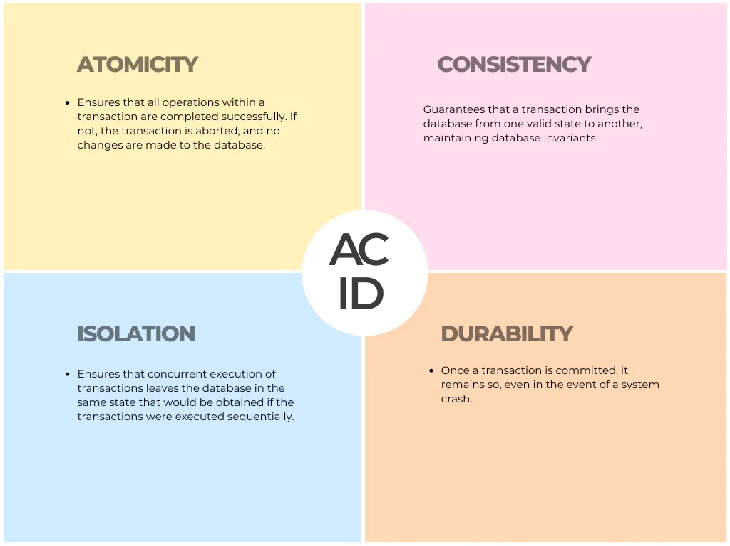

# Database Principles

## ACID (relational / RDBMS)
- **Atomicity** — a transaction is all-or-nothing.
- **Consistency** — data integrity is preserved before and after a transaction.
- **Isolation** — concurrent transactions don't interfere with each other.
- **Durability** — once committed, changes survive crashes.

## BASE (NoSQL)
- **Basically Available** — the system stays available even under partial failure.
- **Soft state** — state may change over time (even without input) due to eventual consistency.
- **Eventual consistency** — replicas converge to a consistent state over time.

## CAP theorem (distributed databases)
- **Consistency** — every read sees the most recent write.
- **Availability** — every request gets a (non-error) response.
- **Partition tolerance** — the system keeps working despite network partitions.
- A distributed system can guarantee only **two of the three** at once. Since partitions are unavoidable,
  the real trade-off is **C vs A** during a partition.

## Interview framing
- RDBMS favor **ACID** (strong consistency); many NoSQL stores favor **BASE / AP** (availability + eventual consistency).
- Pick based on requirements: financial ledgers → ACID; high-availability feeds/carts → AP + eventual consistency.

## Diagrams

