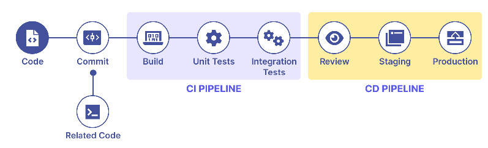
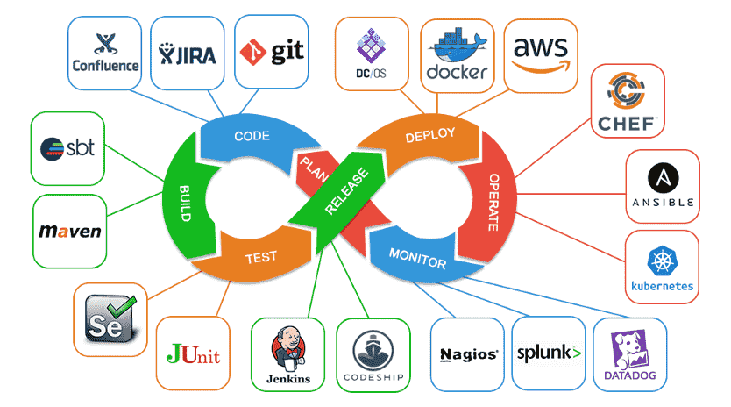
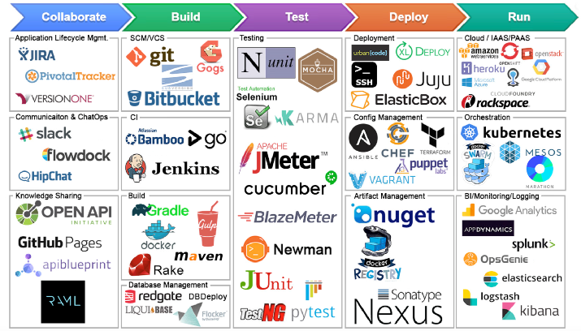

# CI/CD

## Definitions
- **CI (Continuous Integration)** — merge frequently; every push triggers **build + test** to catch issues early.
- **CD (Continuous Delivery)** — every change is *release-ready*; deploy is a manual approval.
- **Continuous Deployment** — every green change auto-deploys to production.

## Typical pipeline stages
`checkout → build → unit tests → static analysis (SonarQube) → package (jar/image) → integration tests → publish artifact → deploy → smoke tests`

## Tools
- **Jenkins** (pipelines as `Jenkinsfile`), **GitHub Actions**, GitLab CI, CircleCI, Argo CD (GitOps).
- Artifacts: Nexus/Artifactory; images: container registry.

## Deployment strategies
- **Rolling** — replace instances gradually.
- **Blue-green** — two environments; switch traffic; instant rollback.
- **Canary** — release to a small % first, then ramp up.

## GitOps
Declarative desired state in git; a controller (**Argo CD**/Flux) syncs the cluster to match. Git is the source of truth.

## Good practices
- Fast, reliable pipelines; fail fast; quality gates (coverage, security scans).
- Immutable artifacts promoted across envs (dev → UAT → prod); no rebuild per env.
- Automated rollback; secrets from a vault, never in the pipeline config.

## Diagrams

