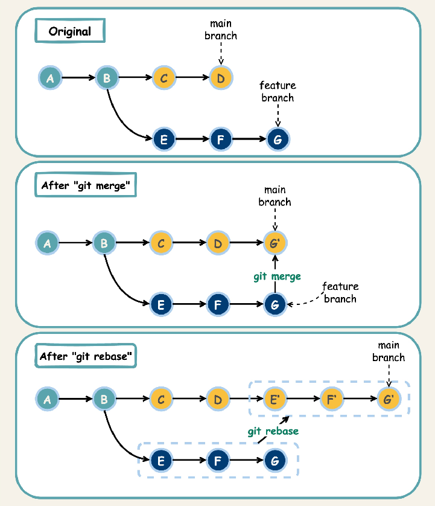

# Git

## GIT

	init
	clone
	status
	add
	diff
	reset
	commit

	fetch
	merge
	push
	pull
	rebase

## Pull vs Rebase

[https://www.atlassian.com/git/tutorials/merging-vs-rebasing](https://www.atlassian.com/git/tutorials/merging-vs-rebasing)
[https://medium.com/@DGabeau/git-pull-rebase-vs-git-pull-c2b352fe53aa](https://medium.com/@DGabeau/git-pull-rebase-vs-git-pull-c2b352fe53aa)

The git pull and git rebase commands are both used to integrate changes from a remote repository into a local branch, but they do so in different ways, leading to different outcomes in the commit history.

**git pull:** Fetches changes from the remote and merges them into your current branch. This creates a merge commit, which explicitly shows where the branches were joined. It preserves the original commit history, making it suitable for collaborative branches where history should not be rewritten.

> git pull origin main

**git rebase:** Fetches changes from the remote and reapplies your local commits on top of them. This results in a linear, cleaner commit history without merge commits. It's often preferred for feature branches before merging them into the main branch, as it simplifies the history.

> git fetch origin
> git rebase origin/main

The choice between git pull and git rebase depends on the situation:

* Use git pull when working on a shared branch to avoid rewriting history.
* Use git rebase on a feature branch before merging to create a cleaner history, but avoid it on shared branches after they have been pushed remotely to prevent complications for collaborators.
* git pull --rebase combines the fetch and rebase steps, offering a shortcut for rebasing while pulling.

## File rename

[https://graphite.dev/guides/rename-file-in-git](https://graphite.dev/guides/rename-file-in-git)

Git tracks file renames using the git mv command. Internally, Git doesn't actually store rename operations as such. Instead, it detects renames by comparing the content of files across commits. When you use git mv, it stages both a delete of the old file and an add of the new file with the new name. During the commit process, Git's rename detection mechanism can recognize that these two changes are related and record it as a rename in the commit history. This mechanism relies on heuristics to match similar file content between the deleted and added files.
> git mv old_filename.txt new_filename.txt

This command stages the rename. You can then commit the change with:
> git commit -m "Rename file: old_filename.txt to new_filename.txt"

If you rename a file without using git mv, Git may not automatically recognize it as a rename. In such cases, you can manually stage the changes using:
Code
> git add new_filename.txt
> git rm old_filename.txt

Git will then attempt to detect the rename during the commit.

## Merging vs. rebasing

https://www.atlassian.com/git/tutorials/merging-vs-rebasing

| Feature  | `git merge` | `git rebase` |
| :---- | :---- | :---- |
| History | Preserves history and creates a merge commit, resulting in a non-linear log. | Rewrites history by reapplying commits, resulting in a cleaner, linear log. |
| Commit IDs | Maintains existing commit IDs and adds a new merge commit. | Creates new commit IDs for the rebased commits. |
| Conflict Resolution | Conflicts are resolved once in a single merge commit. | Conflicts may need to be resolved multiple times, once for each commit as it's reapplied. |
| Safety | Safer for public branches because it doesn't rewrite history. | Risky for public branches because it rewrites history and requires a force push. |
| Best Use Case | To integrate changes from a public or shared branch, or when preserving the exact history is important. | To clean up a feature branch before merging it, or to keep a private branch updated with a main branch. |
