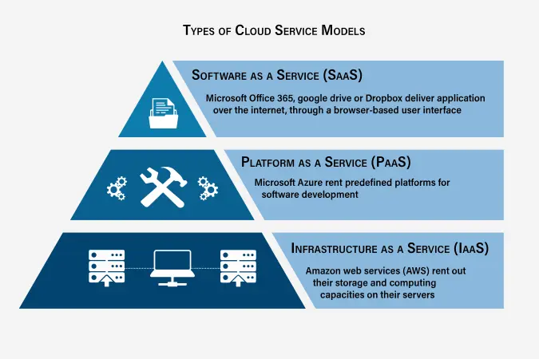
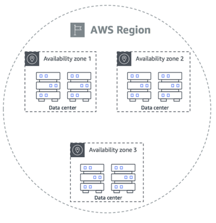
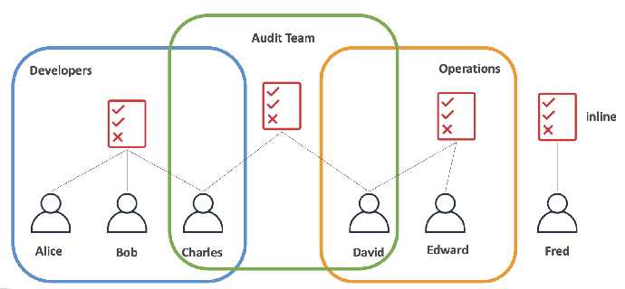
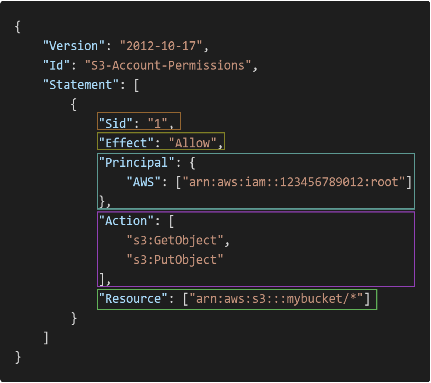
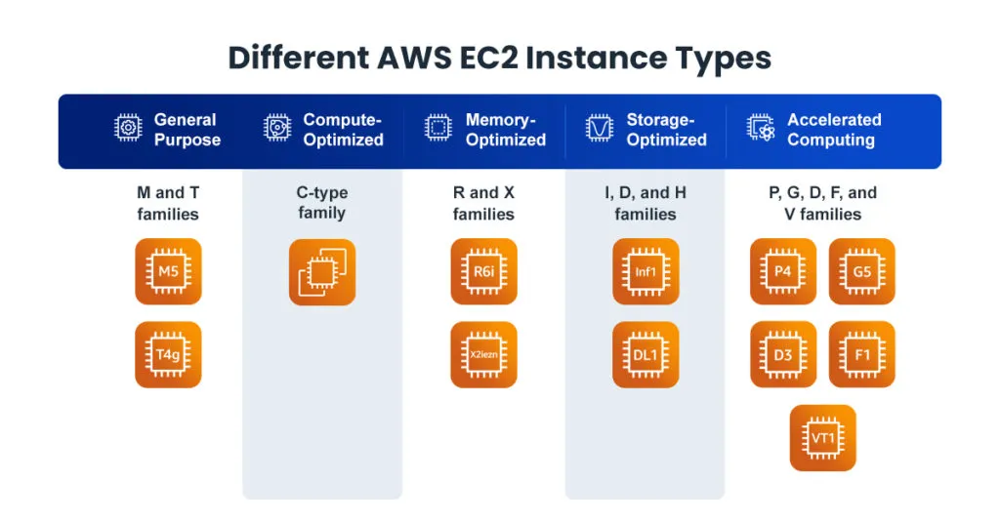
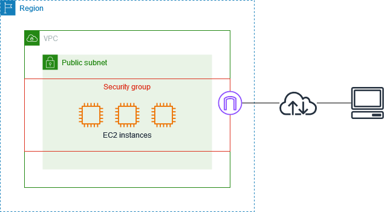

# AWS

## Global infrastructure
- **Region** — geographic area (e.g. us-east-1); pick for latency, compliance, cost, service availability.
- **Availability Zone (AZ)** — isolated data center(s) within a region; deploy across AZs for HA.
- **Edge locations / PoPs** — CDN (CloudFront) caching close to users.

## IAM (Identity & Access Management)
- **Users**, **Groups**, **Roles** (assumed, temporary creds — preferred for services), **Policies** (JSON permissions).
- **MFA**; access keys for programmatic/CLI access.
- Best practices: least privilege, roles over long-lived keys, rotate credentials, no root for daily use.
- **IRSA** (IAM Roles for Service Accounts) on EKS — pods assume IAM roles via a projected token.

## Compute — EC2
- Virtual servers. Instance families: general purpose, compute-optimized, memory-optimized, storage-optimized, accelerated (GPU), HPC, burstable (T-series).
- Purchasing: On-Demand, Reserved, Savings Plans, **Spot** (cheap, interruptible), Dedicated.
- **Security groups** — stateful virtual firewalls (allow rules). **User data** — bootstrap script at launch.

## Common services (breadth)
- **Compute**: EC2, Lambda (serverless), ECS/EKS (containers), Fargate.
- **Storage**: S3 (object), EBS (block), EFS (file).
- **Database**: RDS (relational), DynamoDB (NoSQL), ElastiCache (Redis/Memcached).
- **Networking**: VPC, ELB/ALB, Route 53 (DNS), CloudFront (CDN), API Gateway.
- **Messaging**: SQS, SNS, Kinesis (streaming).
- **Ops**: CloudWatch (metrics/logs), Secrets Manager, KMS.

## Shared Responsibility Model
AWS secures *of* the cloud (hardware, managed services); you secure *in* the cloud (data, IAM, config, patching).

## Diagrams

