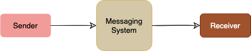
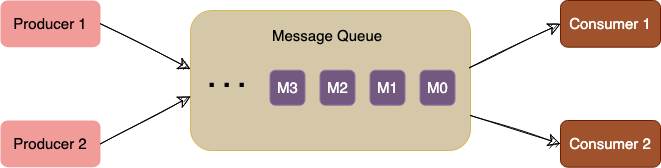
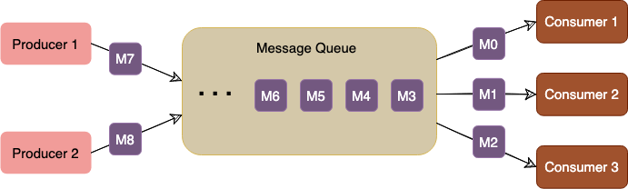
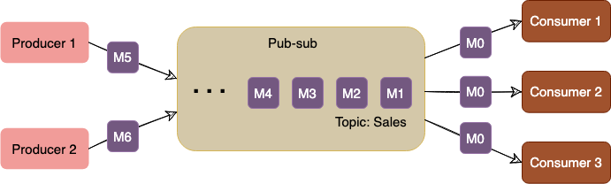
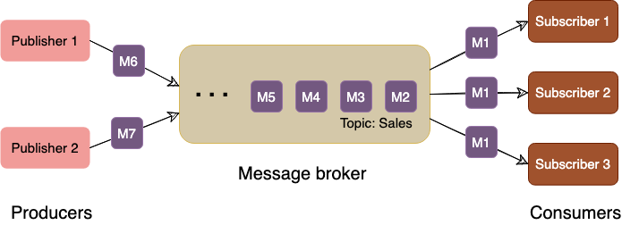
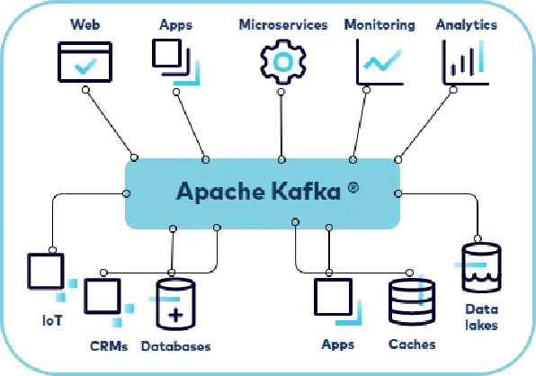
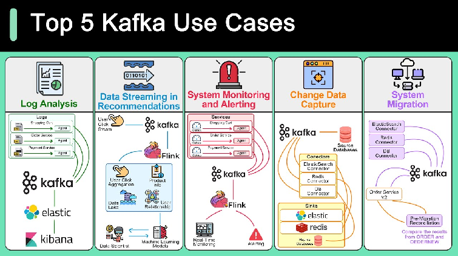
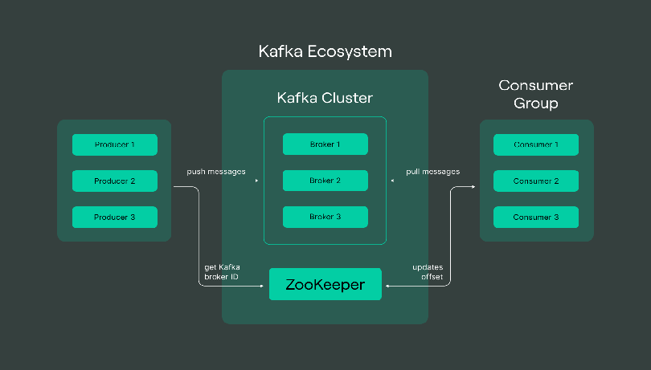

# Messaging Systems

## Why messaging
Decouple producers from consumers, smooth traffic spikes, enable async/event-driven architectures, improve resilience.

## Kafka
Distributed, durable, high-throughput event streaming (log-based).
- **Cluster** — brokers hosting topics/partitions.
- **Producer** — writes messages to a topic.
- **Consumer** — reads; tracks its **offset**; grouped into **consumer groups** for parallelism.
- **Broker** — a Kafka server; bridge between producers and consumers.
- **Topic** — named stream; split into **partitions** (ordered, append-only; ordering guaranteed *within* a partition).
- **Offset** — position of a message in a partition.
- **Replication** — partitions replicated across brokers (leader + followers) for fault tolerance.
- **ZooKeeper / KRaft** — cluster metadata + coordination (newer Kafka uses KRaft, no ZooKeeper).

### Kafka use cases
Log aggregation, stream processing/analytics, microservices event backbone, IoT ingestion, real-time fraud
detection, event sourcing / CQRS.

## Kafka vs RabbitMQ
| | Kafka | RabbitMQ |
|--|-------|----------|
| Model | Distributed log (pull) | Message broker/queue (push) |
| Throughput | Very high | High |
| Retention | Retains messages (replayable) | Removed after ack |
| Ordering | Per partition | Per queue |
| Best for | Streaming, event sourcing, analytics | Task queues, complex routing, RPC |

## Delivery semantics
At-most-once, at-least-once (default, needs idempotent consumers), exactly-once (transactional, costlier).

## Patterns
Pub/sub, work queues, event sourcing, **CQRS** (separate read/write models), the outbox pattern for reliable publish.

## Diagrams

