# SDLC & Methodologies

## Project Management Methodologies

### **Waterfall**

Don’t have ambiguous requirements - no changes once it is underway

1. **Requirements**
2. **Design**
3. **Implementation**
4. **Verification or testing**
5. **Deployment and maintenance**

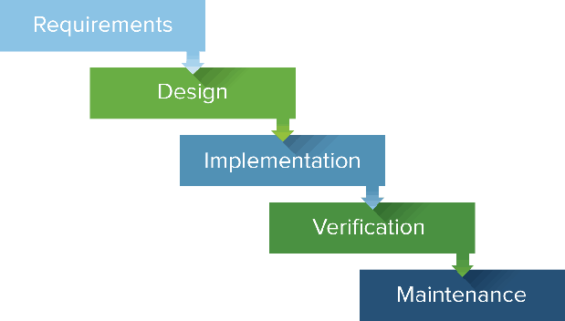

The Waterfall Model, is a linear and sequential approach to software development. It was one of the earliest methodologies used for software development and remains in use today, especially in certain industries where strict requirements and regulations are common, such as in government or aerospace projects. The Waterfall Method is characterized by its distinct phases, each of which must be completed before moving on to the next. Here are the typical phases

1. **Requirements Gathering**: In this initial phase, the project requirements are gathered and documented in detail. This involves thorough communication with stakeholders to understand their needs and expectations for the software.
2. **System Design**: Once the requirements are understood, the system design phase begins. This involves creating a high-level design of the software architecture, including the overall structure, functionality, and interfaces.
3. **Implementation**: With the design in place, the actual coding or implementation of the software begins. Developers write the code based on the specifications outlined in the design phase.
4. **Testing**: Once the implementation is complete, the software is thoroughly tested to ensure it meets the specified requirements. Testing includes various types such as unit testing, integration testing, system testing, and user acceptance testing.
5. **Deployment**: After successful testing, the software is deployed or released to the users or customers. This phase involves installation, configuration, and making the software operational in the intended environment.
6. **Maintenance**: Once the software is deployed, it enters the maintenance phase. This involves fixing any issues that arise, updating the software to address changing requirements, and providing ongoing support to users.

The Waterfall Method is called so because progress flows steadily downwards through these phases, like a waterfall, with each phase building upon the previous one. Once a phase is complete, it is typically difficult to go back and make changes without disrupting the entire process. This makes the Waterfall Method less flexible compared to more iterative and agile approaches. However, it can be suitable for projects with well-defined requirements and where changes are expected to be minimal once development begins.

### **Agile**

[**https://agilemanifesto.org/**](https://agilemanifesto.org/)

* individuals and interactions over processes and tools
* working software over comprehensive documentation
* customer collaboration over contract negotiation
* responding to change over following a plan

**Meet & plan - design - implementation - release - feedback - \* repeat**

Agile methodologies, such as Scrum, Kanban, and Extreme Programming (XP), provide specific frameworks and practices for implementing Agile principles. Some key characteristics of Agile methodologies include:

1. **Iterative Developmen**t: Agile projects are divided into small iterations or sprints, typically lasting one to four weeks. Each iteration results in a potentially shippable product increment.
2. **Continuous Feedback**: Agile teams regularly solicit feedback from customers, stakeholders, and team members, allowing for early identification of issues and opportunities for improvement.
3. **Cross-Functional Teams**: Agile teams are typically small, cross-functional groups consisting of developers, testers, designers, and other necessary roles. This allows for greater collaboration and shared responsibility for the product's success.
4. **Emphasis on Quality**: Agile methodologies prioritize delivering high-quality software by incorporating practices such as test-driven development, continuous integration, and automated testing.
5. **Adaptive Planning**: Agile projects embrace change and uncertainty by using adaptive planning techniques that allow for adjustments to be made throughout the development process.

#### **Scrum**

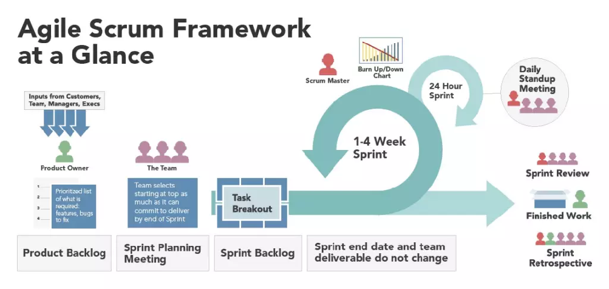
Scrum is one of the most widely used Agile methodologies for managing software development projects. It provides a framework for teams to collaborate effectively and deliver high-quality software iteratively. Scrum emphasizes communication, transparency, and adaptability throughout the development process. Here are some key concepts and components of Scrum:

1. **Roles**
   1. **Scrum Master**: The Scrum Master is responsible for ensuring that the Scrum framework is understood and followed by the team. They facilitate meetings, remove obstacles, and coach the team on Agile practices.
   2. **Product Owner**: The Product Owner represents the stakeholders and is responsible for defining and prioritizing the product backlog, which is the list of all desired features and enhancements.
   3. **Development Team**: The Development Team consists of professionals who are responsible for delivering the product increment in each sprint. They are self-organizing and cross-functional, meaning they have all the skills necessary to deliver the product.

2. **Artifacts**
   1. **Product Backlog**: The Product Backlog is a prioritized list of all features, enhancements, and bug fixes that need to be implemented in the product. It is maintained by the Product Owner and is continuously refined and updated.
   2. **Sprint Backlog**: At the beginning of each sprint, the Development Team selects a set of items from the Product Backlog to work on during the sprint. These items form the Sprint Backlog, which represents the work to be done in the sprint.
   3. **Increment**: The Increment is the sum of all the product backlog items completed during a sprint, along with all previous increments. At the end of each sprint, a potentially shippable product increment is delivered.

3. **Events**
   1. **Sprint**: A sprint is a time-boxed iteration, typically lasting two to four weeks, during which the Development Team works to deliver a potentially shippable product increment.
   2. **Sprint Planning**: At the beginning of each sprint, the Development Team and the Product Owner collaborate to select and prioritize items from the Product Backlog and create a plan for the sprint.
   3. **Daily Scrum**: The Daily Scrum is a short daily meeting, typically lasting 15 minutes, where the Development Team synchronizes their work and plans for the day.
   4. **Sprint Review**: At the end of each sprint, the Development Team presents the completed increment to stakeholders and receives feedback.
   5. **Sprint Retrospective**: The Sprint Retrospective is a meeting held after the Sprint Review where the team reflects on their process and identifies opportunities for improvement.

Scrum promotes transparency, inspection, and adaptation, allowing teams to respond quickly to changes and deliver value to customers more efficiently. By following the Scrum framework, teams can foster collaboration, increase productivity, and deliver high-quality software iteratively.

#### **Kanban**

Kanban is a popular Lean workflow management method for defining, managing and improving services that deliver knowledge work. It helps you visualize work, maximize efficiency, and improve continuously. Work is represented on **Kanban boards**, allowing you to optimize work delivery across multiple teams and handle even the most complex projects in a single environment.

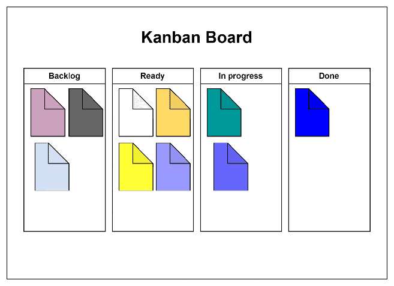

Kanban is a visual management method used to manage work as it moves through a process. Originating from the Toyota Production System, Kanban has been adapted and widely applied in various industries beyond manufacturing, including software development, project management, and service-oriented environments. Kanban emphasizes continuous improvement, workflow optimization, and limiting work in progress (WIP)

1. **Kanban Board**: The Kanban board is a visual representation of the workflow, typically divided into columns representing different stages of the process. Each column contains cards or tickets representing individual work items.

2. **Work Item**s: Work items represent tasks, features, or user stories that need to be completed. These items are visualized on the Kanban board using cards or sticky notes.

3. **Workflow**: The workflow consists of the various stages or steps that work items go through from initiation to completion. Each column on the Kanban board represents a stage of the workflow, such as "To Do," "In Progress," "Review," and "Done."

4. **Work in Progress (WIP) Limits**: WIP limits are constraints placed on the number of work items allowed in each stage of the workflow. WIP limits help prevent overloading individuals or teams with too much work at once, which can lead to inefficiencies and delays.

5. **Pull System**: Kanban operates on a pull-based system, meaning work is pulled into the workflow only when there is capacity to handle it. Work items are not pushed onto individuals or teams but are instead pulled as capacity becomes available.

6. **Continuous Improvement**: Kanban encourages continuous improvement by providing visibility into the workflow and promoting collaboration among team members. Teams regularly review their processes, identify bottlenecks or inefficiencies, and make incremental changes to improve flow and productivity.

7. **Metrics and Analytics**: Kanban utilizes metrics and analytics to measure and monitor the flow of work through the system. Common metrics include lead time (the time it takes for a work item to move from initiation to completion), cycle time (the time it takes to complete a single item), and throughput (the rate at which work items are completed).

Kanban provides a flexible and adaptable approach to managing work, allowing teams to visualize their workflow, optimize their processes, and deliver value to customers more efficiently. By focusing on continuous improvement and limiting work in progress, Kanban helps teams achieve higher levels of productivity and quality.

## BDD & TDD

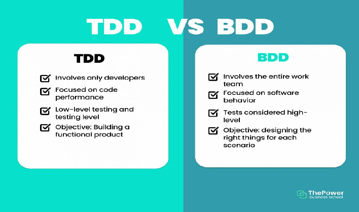

**Behavior Driven Development (BDD)**
Behavior Driven Development (BDD) is a development technique which focuses more on a software application’s behavior. Mainly it creates an executable specification that fails because the respective feature doesn’t exist, then writing the simplest code that can make the specification pass and as a result we get the required behavior implemented in the system.  Actually it is a team methodology where Developers, Customer, QAs are involved in it.

**Process of BDD**

1. Write the behavior of the application
2. Write the automated scripts
3. Then Implement the functional code
4. Check if the behavior is successful and if not success then fix it
5. Organize the code (Optional)
6. Repeat the steps for another behavior

**Test Driven Development (TDD)**
Test Driven Development (TDD) is a development technique which focuses more on the implementation of a feature of a software application/product.  Mainly it refers to write a test case that fails because the specified functionality doesn’t exist and after that update the code that can make the test case pass and as a result we get the feature implemented in the system. Actually it is a development practice where the developers are involved in it.

**Process of TDD**

1. Add test case
2. Run the test cases and watch test fails
3. Update the code
4. Run the test cases again
5. Refactor the code (Optional)
6. Repeat the steps for another test case

| # | Behavior Driven Development | Test Driven Development |
| :---- | :---- | :---- |
| 1 | Behavior Driven Development is a development technique which focuses more on a software application’s behavior. | Test Driven Development is a development technique which focuses more on the implementation of a feature of a software application/product. |
| 2 | In BDD the participants are Developers, Customer, QAs. | In TDD the participants are developers. |
| 3 | Mainly it creates an executable specification that fails because the respective feature doesn’t exist, then writing the simplest code that can make the specification pass and as a result we get the required behavior implemented in the system. | Mainly it refers to write a test case that fails because the specified functionality doesn’t exist and after that update the code that can make the test case pass and as a result we get the feature implemented in the system. |
| 4 | Its main focus is on system requirements. | Its main focus is on unit test. |
| 5 | In BDD the starting point is a scenario. | In TDD the starting point is a test case. |
| 6 | It is a team methodology. | It is a development practice. |
| 7 | Here language used to write behavior/scenarios is simple English language. | Here language is used is similar to the one used for feature development like programming language. |
| 8 | In BDD collaboration is required between all the stakeholders. | In TDD collaboration is required only between the developers. |
| 9 | It is a good approach for project development which are driven by user actions. | It is a good approach for projects which involve API and third-party tools. |
| 10 | Some of the tools used are Cucumber, Dave, JBehave, Spec Flow, Concordian, BeanSpec etc. | Some of the tools used are JBehave, JDave, Cucumber, Spec Flow, BeanSpec, FitNesse etc. |

## Semantic Versioning

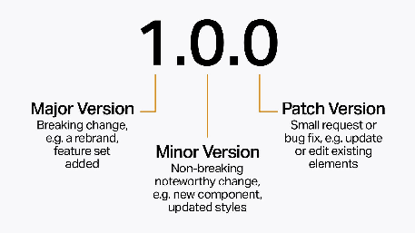

Given a version number **MAJOR.MINOR.PATCH**, increment the:

* **MAJOR** version when you make incompatible API changes
* **MINOR** version when you add functionality in a backward compatible manner
* **PATCH** version when you make backward compatible bug fixed

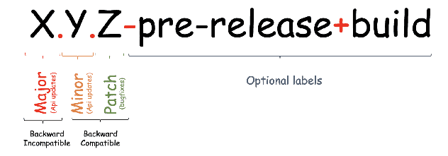

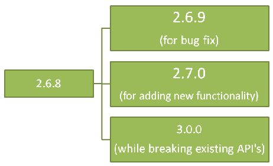

 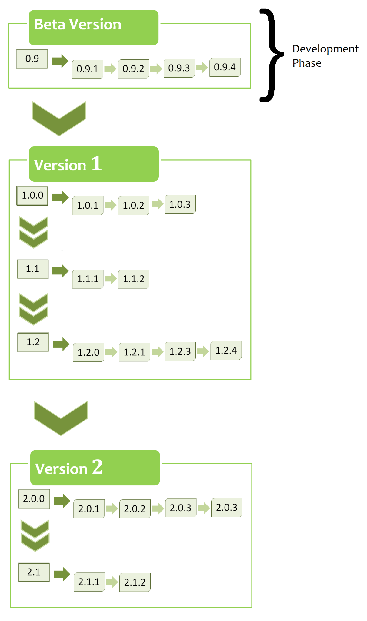

Valid identifiers are in the set [A-Za-z0-9] and cannot be empty. **Pre-release metadata** is identified by appending a hyphen to the end of the SemVer sequence. Thus a pre-release for version 1.0.0 could be 1.0.0-alpha.1. Then if another build is needed, it would become 1.0.0-alpha.2, and so on. Note that names cannot contain leading zeros, but hyphens are allowed in names for pre-release identifiers.

**Advantages of SemVer**

* You can keep track of every transition in the software development phase.
* Versioning can do the job of explaining the developers about what type of changes have taken place and the possible updates that should take place in the software.
* It helps to keep things clean and meaningful.
* It helps other people who might be using your project as a dependency.

**Points to keep in mind**

* The first version starts at 0.1.0 and not at 0.0.1, as no bug fixes have taken place, rather we start with a set of features as the first draft of the project.
* Before 1.0.0 is only the Development Phase, where you focus on getting stuff done. This stage is for developers in which the system is being developed.
* SemVer does not cover libraries tagged 0.\*.\*. The first stable version is 1.0.0.

## Programming Paradigms

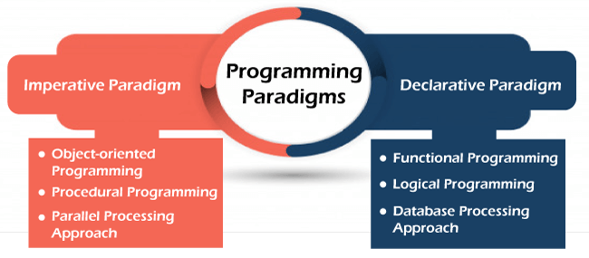
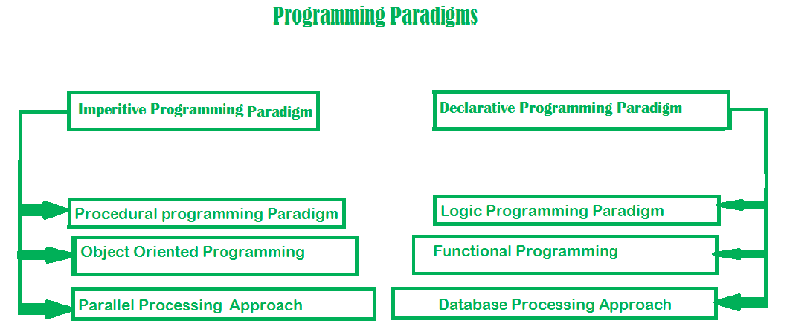

| Basis of Comparison | Imperative Paradigm | Declarative Paradigm |
| :---- | :---- | :---- |
| Programming Style | Its style is step by step. | Define what the problem is and what data transformations are needed. |
| Approach | It follows a traditional approach. | It follows a non-traditional approach. |
| Programmer Focuses | It describes how to solve problems. | It describes what the problem is. |
| Decision Capability | The user makes decisions and instructs the compiler. | It allows the compiler to make decisions. |
| Consist of | It is a sequence of commands. | It is a set of statements. |
| Flow | It expresses control flow. | It expresses data flow. |
| State Change | It is important. | It does not exist. |
| Primary Manipulation Unit | Instances of classes and structure. | Functions as first-class object and data collections. |
| Order of execution | Order of execution is important. | Order of execution is not important. |
| Example | C, FORTRAN, Ada, Python, etc. | PROLOG, LISP, Haskell, ASP, etc. |

1. **Imperative programming paradigm**
   It is one of the oldest programming paradigm. It features close relation to machine architecture. It is based on Von Neumann architecture. It works by changing the program state through assignment statements. It performs step by step task by changing state. The main focus is on how to achieve the goal. The paradigm consist of several statements and after execution of all the result is stored.

   **Advantages**
* Very simple to implement
* It contains loops, variables etc.

  **Disadvantage**
* Complex problem cannot be solved
* Less efficient and less productive
* Parallel programming is not possible

**Types**

1. **Procedural Programming**

   This paradigm emphasizes on procedure in terms of under lying machine model. There is no difference in between procedural and imperative approach. It has the ability to reuse the code and it was boon at that time when it was in use because of its reusability.

2. **Object-oriented Programming**

   The program is written as a collection of classes and object which are meant for communication. The smallest and basic entity is object and all kind of computation is performed on the objects only. More emphasis is on data rather procedure. It can handle almost all kind of real life problems which are today in scenario.

3. **Parallel Processing Approach**

   Parallel processing is the processing of program instructions by dividing them among multiple processors. A parallel processing system posses many numbers of processor with the objective of running a program in less time by dividing them. This approach seems to be like divide and conquer

| Procedural Programming | Object-oriented Programming | Parallel Processing Approach |
| :---: | :---: | :---: |
| FORTRAN COBOL  ALGOL BASIC C Pascal | Java Python C++ C# Kotlin Scala Swift Ruby Perl | SISAL Parallel Haskell SequenceL System C (for FPGAs) Mitrion-C VHDL Verilog MPI |

2. **Declarative programming paradigm**
   It is divided as Logic, Functional, Database. In computer science the declarative programming is a style of building programs that expresses logic of computation without talking about its control flow. It often considers programs as theories of some logic.It may simplify writing parallel programs. The focus is on what needs to be done rather how it should be done basically emphasize on what code is actually doing. It just declares the result we want rather how it has be produced. This is the only difference between imperative (how to do) and declarative (what to do) programming paradigms. Getting into deeper we would see logic, functional and database.

   **Advantages**
* Efficient and shortcode
* Referential Transparency
* Idempotence
* Error recovery
* Readability
* Commutativity
* Easy optimization

  **Disadvantages**
* Difficult to understand.
* It is abed on an unfamiliar conceptual model.
* Difficult to accept characteristics of specific applications into account while programming.

  **Types**
1. **Logical Programming**

   It can be termed as abstract model of computation. It would solve logical problems like puzzles, series etc. In logic programming we have a knowledge base which we know before and along with the question and knowledge base which is given to machine, it produces result. In normal programming languages, such concept of knowledge base is not available but while using the concept of artificial intelligence, machine learning we have some models like Perception model which is using the same mechanism.

2. **Functional Programming**

   The functional programming paradigms has its roots in mathematics and it is language independent. The key principle of this paradigms is the execution of series of mathematical functions. The central model for the abstraction is the function which are meant for some specific computation and not the data structure. Data are loosely coupled to functions.The function hide their implementation. Function can be replaced with their values without changing the meaning of the program.

3. **Database Processing Approach**

   This programming methodology is based on data and its movement. Program statements are defined by data rather than hard-coding a series of steps. A database program is the heart of a business information system and provides file creation, data entry, update, query and reporting functions. There are several programming languages that are developed mostly for database application. For example SQL. It is applied to streams of structured data, for filtering, transforming, aggregating (such as computing statistics), or calling other programs.

| Logical Programming | Functional Programming | Database Processing Approach |
| :---: | :---: | :---: |
| PROLOG | Haskell SML Clojure Scala Erlang Clean F# | SQL (only DQL) QML RDQL SPARQL |

## SDLC Envs

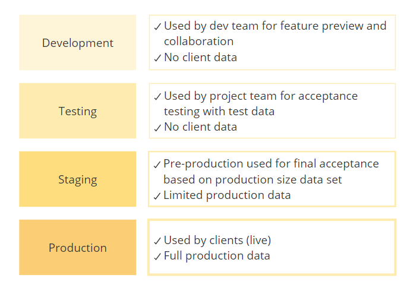
?? Devops - tasks - dev task -
?? Sass and others
