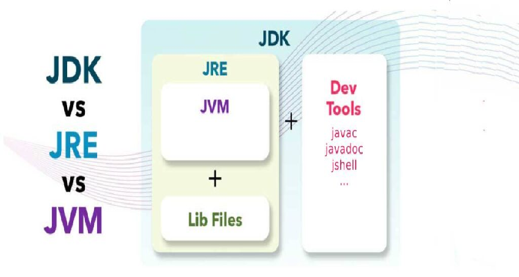
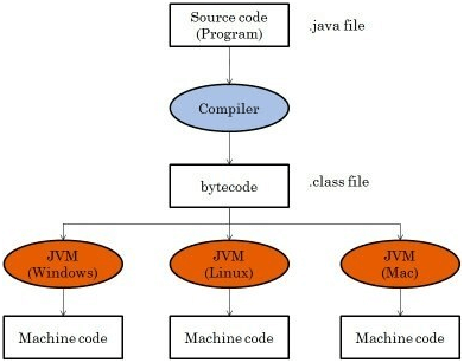
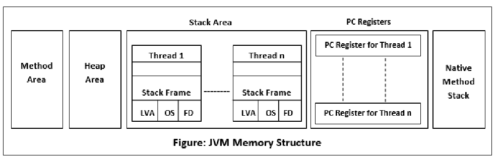
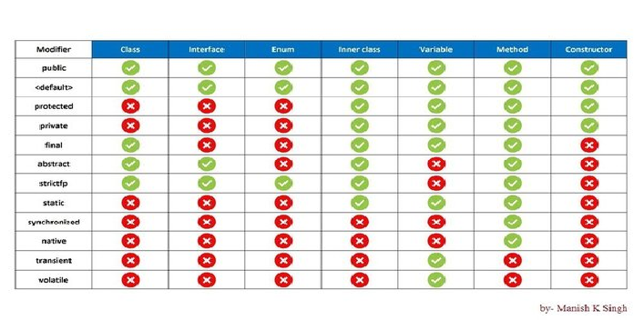
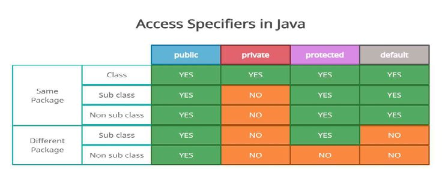

# Java Basics

## Editions
- **Java SE** (Standard) — core language + libraries.
- **Java EE / Jakarta EE** — enterprise APIs (Servlets, JPA, JMS…).
- **Java ME** — embedded/mobile.

## JDK vs JRE vs JVM
- **JVM** — runtime that executes bytecode; platform-specific; provides GC, JIT, memory management.
- **JRE** — JVM + core libraries (run apps).
- **JDK** — JRE + dev tools (compiler `javac`, `jar`, `jshell`) — build + run.
- "Write once, run anywhere": `javac` → bytecode (`.class`) → JVM interprets/JIT-compiles.

## Memory model (runtime areas)
- **Heap** — objects; managed by GC. Young (Eden + survivor) + Old gen.
- **Stack** — per-thread frames: local variables, partial results.
- **Metaspace** (Java 8+, replaced PermGen) — class metadata.
- **PC register** + **native method stack**.
- **GC**: G1 (default), ZGC/Shenandoah (low-pause). GC frees unreachable objects.

## Core concepts
- **Pass-by-value** always — for objects, the *reference value* is copied.
- Primitives vs wrappers; autoboxing/unboxing; **Integer cache** (-128..127).
- `==` (reference/identity) vs `.equals()` (logical equality); override `equals` + `hashCode` together.

## POJO / JavaBean / EJB
- **POJO** — plain object, no framework constraints.
- **JavaBean** — POJO with no-arg constructor, private fields, getters/setters, `Serializable`.
- **EJB** — heavyweight enterprise component (legacy).

## `public static void main(String[] args)`
JVM entry point; `static` (no instance needed), `void`, `String[]` args. Wrong signature compiles but won't run.

## Diagrams

