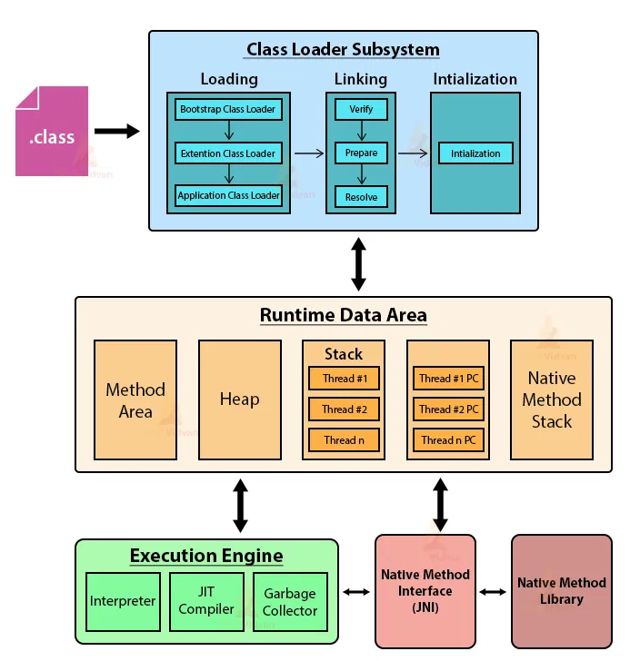
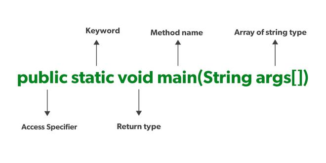

# Java Basics

### Java Editions

Java has several editions, each catering to different platforms and use cases

* **Java Standard Edition**
  * Java SE is the core Java platform designed for developing and running desktop applications, web applications, and server-side applications.
  * It includes the Java Development Kit (JDK), which provides tools for compiling, debugging, and running Java programs.
  * Java SE also includes the Java Runtime Environment (JRE), which is required to run Java applications on end-user devices.
  * Java SE is widely used for developing a variety of applications, including enterprise software, mobile apps, and games.

.

* **Java Enterprise Edition**
  * Java EE is a set of specifications and APIs for developing enterprise-scale applications, particularly web-based and distributed systems.
  * It provides a runtime environment and libraries for building server-side components such as servlets, JavaServer Pages (JSP), Enterprise JavaBeans (EJB), and Java Persistence API (JPA).
  * Java EE also includes support for web services, messaging, security, and transactions.
  * Java EE application servers, such as Apache Tomcat, WildFly, and IBM WebSphere, provide implementations of the Java EE specifications.

* **Java Micro Edition - Embedded devices**
  * Java ME is a platform for developing applications for resource-constrained embedded devices, such as mobile phones, smart cards, and IoT devices.
  * It provides a subset of the Java SE platform optimized for devices with limited memory, processing power, and display capabilities.
  * Java ME includes profiles and configurations tailored to specific types of devices, allowing developers to target a wide range of embedded platforms.

* **Javafx**
  * JavaFX is a platform for creating rich internet applications (RIAs) and modern user interfaces (UIs) for desktop, mobile, and embedded platforms.
  * It provides a set of APIs for developing graphical user interfaces, multimedia applications, and 2D/3D graphics.
  * JavaFX is designed to work seamlessly with Java SE, allowing developers to create cross-platform applications using familiar Java programming techniques.

### Java Versions

[https://pianalytix.com/java-versions-its-features/](https://pianalytix.com/java-versions-its-features/)
[https://ioflood.com/blog/java-versions/](https://ioflood.com/blog/java-versions/)
[https://howtodoinjava.com/series/java-versions-features/](https://howtodoinjava.com/series/java-versions-features/)
[https://www.marcobehler.com/guides/a-guide-to-java-versions-and-features](https://www.marcobehler.com/guides/a-guide-to-java-versions-and-features)

1. **Java  8 aka Spider**
* Lambda expression support in APIs
* Stream API
* Functional interface and default methods
* Optionals
* Nashorn – JavaScript runtime which allows developers to embed JavaScript code within applications
* Annotation on Java Types
* java.time package for date and time manipulation

2. **Java 9**
* The biggest change is the modularization i.e. Java modules.
* Enhancements to the Java platform including the new HTTP/2 client, and the new process API.
* Deprecation of the Applet API.
* Project Jigsaw modularizes the JDK, aiming for better scalability, maintainability, and performance.
* Jshell - can try out simple commands and get immediate results.
* Interfaces got private methods:
* Improvements in Stream API
  * Limiting Stream with takeWhile() and dropWhile() methods
  * Overloaded Stream iterate method
  * New Stream ofNullable() method
* Collection API Updates
  * Collections got a couple of new helper methods, to easily construct Lists, Sets and Maps.
* Optionals got the sorely missed ifPresentOrElse method.
* HTTP 2 Client

3. **Java 10**

		Var Keyword, Garbage Collector Interface.

4. **Java 11 & 12**

		API updates

5. **Java 13**

		text blocks
		Switch Expression Enhancements

6. **Java 14 & 15**

		records
		Developer oriented updates

7. **Java 16**
   made the Java Records and Pattern matching the standard features of the Java language.

8. **Java 17**

		Spring enhanced support

**LTS versions - Long-Term Support**
These are specific versions of Java SE (Standard Edition) that Oracle designates for extended support.

* Benefits: LTS releases receive bug fixes and security patches for a longer period compared to regular releases, ensuring stability and compatibility for your applications.

* Support Duration: LTS versions are typically supported for at least 4 years with Premier Support from Oracle, followed by an additional 3 years of Extended Support.

* Current LTS versions: As of April 2024, the current LTS versions are Java 8, 11, 17, and 21.
  * Java 8 through at least 2030
  * Java 11 through 2026
  * Java 17 through at least 2029

Versions and features explained ???

### JDK, JRE, JVM

| JVM - Java Virtual Machine | JRE - Java Runtime Environment | JDK - Java Development Kit |
| :---- | :---- | :---- |
| A virtual machine that enables a computer to run Java programs as well as programs written in other languages that are also compiled to Java bytecode Its implementation is known as JRE JVM is Machine/OS-specific  | A software layer that runs on top of a computer’s operating system software and provides the class libraries and other resources that a specific Java program needs to run. Java Class Libraries: These are pre-written classes that provide a wide range of functionalities for developers. They cover areas like I/O operations, networking, data structures, user interface components, and more. These libraries simplify development by offering pre-built solutions for common tasks.  | A cross-platform software development environment that offers a collection of tools and libraries necessary for developing Java-based software applications and applets. It is a core package used in Java, along with the JVM (Java Virtual Machine) and the JRE (Java Runtime Environment).  JDK contains Java Runtime Environment (JRE), An interpreter/loader (Java), A compiler (javac), An archiver (jar) and many more. |

1. **ByteCode**
   The Java bytecode is the intermediate representation of Java source code after it has been compiled by the Java compiler (javac). Instead of compiling directly to machine code, Java source code is compiled into bytecode, which is a platform-independent binary format.

   Java bytecode is executed by the Java Virtual Machine (JVM), which is part of the Java Runtime Environment (JRE). The JVM is responsible for interpreting or just-in-time (JIT) compiling bytecode into machine code that can be executed by the underlying hardware.

2. **ClassLoader**
   The Java ClassLoader dynamically loads all classes necessary to run a Java program. Since Java classes are only loaded into memory when they're required, the JRE uses ClassLoaders to automate this process on demand.

3. **Bytecode verifier**
   The bytecode verifier ensures the format and accuracy of Java code before it passes to the interpreter. In the event that the code violates system integrity or access rights, the class will be considered corrupted and won't be loaded.

4. **Interpreter**
   After the bytecode successfully loads, the Java interpreter creates an instance of the JVM that allows the Java program to be executed natively on the underlying machine.

5. **javac**
   The Java Compiler (javac) is a command-line tool that compiles Java source code files (.java) into bytecode files (.class) that can be executed by the Java Virtual Machine (JVM).

6. **JShell**
   Introduced in Java 9, JShell is an interactive Read-Eval-Print Loop (REPL) tool that allows developers to experiment with Java code snippets and immediately see the results. It's particularly useful for testing small code fragments, exploring APIs, and learning Java syntax.

7. **Javadoc**
   The Javadoc tool (javadoc) generates HTML documentation from Java source code files. It extracts specially formatted comments (JavaDoc comments) from the source code and formats them into HTML pages, providing an easy-to-read reference for APIs.

8. **Java Debugger (jdb)**: The Java Debugger (jdb) is a command-line debugging tool that allows developers to debug Java programs interactively. It provides features such as setting breakpoints, stepping through code, inspecting variables, and evaluating expressions.

9. **Java Archive Tool (jar)**
   The Java Archive tool (jar) is used to package Java classes and resources into a single compressed file called a JAR (Java Archive). JAR files are commonly used to distribute libraries, applications, or Java applets.

10. **Javap**
    Javap is a command-line tool in the Java Development Kit (JDK) used to disassemble compiled Java class files. It displays information about the class's bytecode instructions, constant pool, fields, and methods in a human-readable format. Developers use javap for debugging, analyzing bytecode, and understanding the structure of compiled Java classes.

11. **JIT**
    [https://www.baeldung.com/graal-java-jit-compiler](https://www.baeldung.com/graal-java-jit-compiler)

    JIT (Just-In-Time) compilation in Java dynamically translates Java bytecode into native machine code during runtime, optimizing performance by executing compiled code directly. By identifying hot spots in the code and compiling frequently executed portions, JIT compilation enhances the execution speed of Java applications. This adaptive optimization process allows the JVM to balance between compilation overhead and runtime performance, achieving efficient execution on diverse hardware architectures.

    The JDK implementation by Oracle is based on the open-source OpenJDK project. This includes the HotSpot virtual machine, available since Java version 1.3. It contains two conventional JIT-compilers: the client compiler, also called C1 and the server compiler, called opto or C2.

    C1 is designed to run faster and produce less optimized code, while C2, on the other hand, takes a little more time to run but produces a better-optimized code. The client compiler is a better fit for desktop applications since we don’t want to have long pauses for the JIT-compilation. The server compiler is better for long-running server applications that can spend more time on the compilation.

**Class Loaders**
[https://www.baeldung.com/java-classloaders](https://www.baeldung.com/java-classloaders)

In Java, class loaders are a fundamental part of the runtime environment. They are responsible for dynamically loading Java classes into the Java Virtual Machine (JVM) on demand.

**What they do**

* Class loaders handle loading \`.class\` files (containing bytecode) from various sources like the file system, network, or even custom locations depending on the implementation.
* They ensure that only required classes are loaded when needed, optimizing memory usage by avoiding upfront loading of all classes.
* They maintain class visibility and uniqueness within the JVM.

**Key principles**

* **Delegation Model**: Class loaders follow a parent-child hierarchy. When a class needs to be loaded, the request is delegated to the parent class loader first. The parent attempts to load the class, and if unsuccessful, the child class loader takes over. This ensures a standard search path and avoids conflicts.
* **Visibility**: A child class loader can see all classes loaded by its parent and ancestors. This allows for classes in different parts of the application to access commonly used classes loaded by the parent class loader. However, the reverse is not true – a parent class loader cannot see classes loaded by its child.
* **Uniqueness**: Class loaders guarantee that a class is loaded only once within the JVM, even if requested multiple times or from different sources. This prevents conflicts arising from duplicate class definitions.

**Types of Class Loaders in Java**

* **Bootstrap Class Loader (Primitive Bootstrap Loader):** This is the root of the hierarchy and is responsible for loading core JDK classes like \`java.lang.Object\`. It's written in native code and not accessible from Java code.
* **Extension Class Loader:** Loads classes from the \`$JAVA_HOME/lib/ext\` directory, typically containing extension libraries.
* **System Class Loader:** Loads classes from the system classpath, which is usually defined by the \`CLASSPATH\` environment variable. This is the class loader used for most user-written classes.
* **Application Class Loaders (Custom):** Developers can create custom class loaders to load classes from specific locations or implement custom loading logic.

**Benefits of Class Loaders**

* **Security**: By controlling class loading, the JVM can enforce security restrictions on where classes can be loaded from.
* **Flexibility**: Class loaders allow for modularity and customization of how classes are loaded.
* **Memory Efficiency**: Loading classes on demand helps optimize memory usage by avoiding unnecessary loading of unused classes.

### Java Memory Management

**Garbage Collector**
Java garbage collection (GC) is an automatic process that manages memory allocation and reclaims memory occupied by unused objects in the Java heap.

A core feature of the Java Runtime Environment (JRE) that eliminates the need for manual memory management (unlike languages like C++).
It automatically identifies and removes objects that are no longer referenced by the program, freeing up memory for new object creation.

Methods like **System.gc() or Runtime.getRuntime().gc()** only request the JVM to run GC. The JVM might decide not to perform collection due to various factors, like ongoing program activity or insufficient memory overhead.

**Working**

* **Memory Allocation**: When a Java object is created, memory is allocated for it in the heap, a dedicated memory region managed by the garbage collector.
* **Object Reachability**: The garbage collector determines if an object is still reachable or "live." An object is considered live if it's referenced by a variable or another object that's still in use by the program.
* **Garbage Collection Cycle**: The GC runs periodically or when memory usage reaches a certain threshold. It uses algorithms to identify unreachable objects (garbage) and removes them from the heap.

**Common GC Algorithms**

* **Mark-Sweep**: This is a basic algorithm that identifies reachable objects by marking them and then sweeping the heap to reclaim unmarked objects (garbage).
* **Mark-Compac**t: Similar to mark-sweep, but after marking live objects, it compacts them into a contiguous memory space, reducing memory fragmentation and potentially improving performance.
* **Generational Garbage Collection**: This is a more complex approach that divides the heap into generations based on object lifetimes. Younger generations (where objects are more likely to become garbage) are collected more frequently than older generations (where objects tend to have longer lifespans).

**Impact on Application Performance:**

* While GC automates memory management, it can sometimes cause pauses in program execution during collection cycles, especially for large heaps or complex object structures.
* Understanding GC behavior and tuning GC parameters can help optimize application performance and minimize GC pauses.

**Key Points to Remember:**

* You don't explicitly call GC in most cases. The JVM manages the GC process automatically.
* However, you can use the System.gc() method as a suggestion to the JVM to run garbage collection, but there's no guarantee it will happen immediately.
* Proper object management practices like avoiding memory leaks (holding references to unused objects) can improve GC efficiency.

**Java Memory Structure**
[https://freedium.cfd/https://dip-mazumder.medium.com/java-memory-model-a-comprehensive-guide-ba9643b839e](https://freedium.cfd/https://dip-mazumder.medium.com/java-memory-model-a-comprehensive-guide-ba9643b839e)

****

* **Heap Memory**
  * The heap is the primary memory area where objects are allocated. It's a shared resource among all threads in a Java application.
  * The heap is divided into two main generations: the Young Generation and the Old Generation.
  * The Young Generation further consists of Eden space and Survivor spaces (S0 and S1).
  * Objects are initially allocated in the Eden space. Surviving objects are promoted to Survivor spaces during garbage collection.

* **Stack Memory**
  * Each thread in a Java application has its own stack memory.
  * The stack memory stores method invocations and local variables for each thread.
  * It operates in a Last-In-First-Out (LIFO) manner, with method calls and local variables pushed onto the stack as methods are invoked and popped off when methods return.

| Feature | Heap | Stack |
| :---- | :---- | :---- |
| **Functionality** | Stores all objects created during program execution. Objects reside in the heap until the garbage collector identifies them as unused and reclaims the memory. | Manages method calls, local variables, and frames (activation records) for each thread. The stack follows a Last-In-First-Out (LIFO) approach, where the most recently called method is at the top. |
| **Memory Allocation** | Uses dynamic memory allocation. The size of the heap can be adjusted while the program runs. | Uses static memory allocation. The stack size is typically predefined and limited, and it grows or shrinks as methods are called and return. |
| **Lifetime** | Objects in the heap can persist throughout the program's execution as long as they are referenced. The garbage collector determines when to remove them. | Data on the stack is temporary and specific to the current method execution. Once the method call finishes, the associated frame and variables are removed from the stack. |
| **Thread Visibility** | Objects in the heap are generally accessible by all threads in the program, although proper synchronization mechanisms are needed to avoid data races | Each thread has its own separate stack, and data on the stack is not directly accessible by other threads |
| **Management** | Managed by the garbage collector (GC). The GC automatically identifies and removes unused objects from the heap | Managed automatically by the JVM. When a stack overflow occurs (running out of stack space), a StackOverflowError exception is thrown. |

* **Method Area (PermGen/Metaspace)**
  * The method area stores class metadata, static fields, and method bytecode.
  * In older versions of Java (up to Java 7), the method area was known as PermGen (Permanent Generation). It stored metadata related to classes and methods.
  * In Java 8 and later versions, PermGen was replaced by Metaspace, which stores class metadata and other related information.

* **Native Memory**
  * Native memory is memory outside the JVM managed by the operating system.
  * It includes memory used by the JVM itself, as well as native libraries and resources accessed by Java applications.

* **Code Cache**
  * The code cache stores compiled native code generated by the Just-In-Time (JIT) compiler.
  * It helps improve the performance of Java applications by storing frequently executed bytecode as compiled native code.

* **Program Counter (PC)**
  * Tracks the currently executing instruction within a method.

Java out of memory , heap memory issue

### Java Core

#### Access modifiers

****

1. **public**
2. **private**
3. **protected**
4. **default**

   

5. **final**

[https://www.geeksforgeeks.org/final-keyword-in-java/](https://www.geeksforgeeks.org/final-keyword-in-java/)
[https://www.baeldung.com/java-static-final-order](https://www.baeldung.com/java-static-final-order)

* *variable* - Once assigned can’t change the value
  * an empty final variable can be assigned via constructor
* *method* -  cannot override it
* *class* - cannot extend it.

***const - reserved keyword, can’t be used as a variable name or as a modifier.***

6. **synchronized**
* logic marked with synchronized  - allowing only one thread to execute at any given time.
* synchronized keyword on different levels: Instance methods, Static methods & Code blocks

7. **abstract**
* Static methods can be inherited, but can’t be override
* can have both concrete and abstract methods

8. **native**
* A non-access modifier that is used to access methods implemented in a language other than Java like C/C++
* A method marked as native cannot have a body and should end with a semicolon

9. **strictfp**

10. **transient**
* Variable is not serialized
* can be static and final - but no impact

11. **volatile**
* To ensure that updates to variables propagate predictably to other threads(multi threading, synchronization)

#### Static

In Java, the static keyword is a non-access modifier used for memory management. It associates a variable, method, block, or nested class with the class itself rather than with specific instances (objects) of the class. This means that only one copy of a static member exists, regardless of how many objects of the class are created.

1. **Static Variables**
   Static variables are class-level variables shared among all instances of the class. They are declared using the static keyword before the variable type.

2. **Static Methods**
   Static methods belong to the class and can be called without creating an object of the class. They are declared using the static keyword before the return type. Static methods can only access static variables and other static methods.

3. **Static Blocks**
   Static blocks are used to initialize static variables or perform other static initialization tasks. They are executed only once when the class is loaded into memory.

4. **Static Nested Classes**
   Nested classes can be declared as static, in which case they do not have access to the instance members of the outer class. They are accessed using the outer class name.

**Java Variable (Instance Variable) vs Static Variable (Class Variable)**

The primary difference between a Java variable and a static variable lies in their scope, lifetime, and how they are accessed.

| Feature | Java Variable (Instance Variable) | Static Variable (Class Variable) |
| :---- | :---- | :---- |
| **Scope** | Belongs to a specific instance (object) of a class. Each object has its own copy of the variable. | Belongs to the class itself. All instances of the class share the same copy of the variable. |
| **Lifetime** | Created when an object is created using the new keyword and destroyed when the object is garbage collected. | Created when the program starts and destroyed when the program terminates. |
| **Access** | Accessed through an object reference (e.g., objectName.variableName). | Accessed directly using the class name (e.g., ClassName.variableName) or through an object reference. |
| **Memory Allocation** | Memory is allocated for each instance variable when an object is created. | Memory is allocated only once for a static variable, regardless of the number of objects created. |
| **Use Cases** | Represents attributes or states specific to an object. | Represents data or behavior shared among all objects of a class, like constants or counters. |

**Method (Instance Method) vs Static Method**
The core difference between a Java method and a static method lies in their association and accessibility. A regular method, also known as an instance method, is tied to a specific object (instance) of a class. To call an instance method, one must first create an object of that class. On the other hand, a static method belongs to the class itself, not to any specific instance. It can be called directly using the class name, without needing to create an object

| Feature | Method (Instance Method) | Static Method |
| :---- | :---- | :---- |
| **Association** | Associated with an object of the class | Associated with the class itself |
| **Access** | Accessed through an object of the class | Accessed directly using the class name |
| **"this" keyword** | Can access instance variables and methods using the "this" keyword | Cannot use the "this" keyword |
| **Access to Instance Members** | Can directly access both static and non-static members (variables and methods) | Can only directly access static members |
| **Memory** | Multiple copies exist, one for each instance | Only one copy exists, shared by all instances |
| **Use Cases** | Operations that depend on the state of a specific object | Utility functions, operations that don't depend on object state |

#### Java main() Method

[https://www.geeksforgeeks.org/java-main-method-public-static-void-main-string-args/](https://www.geeksforgeeks.org/java-main-method-public-static-void-main-string-args/)

**public static void main(String[] args)**

Java’s main() method is the starting point from where the JVM starts the execution of a Java program. JVM will not execute the code, if the program is missing the main method. Hence, it is one of the most important methods of Java, and having a proper understanding of it is very important.

The Java compiler or JVM looks for the main method when it starts executing a Java program. The signature of the main method needs to be in a specific way for the JVM to recognize that method as its entry point. If we change the signature of the method, the program compiles but does not execute.

The execution of the Java program, the java.exe is called. The Java.exe in turn makes Java Native Interface or JNI calls, and they load the JVM. The java.exe parses the command line, generates a new String array, and invokes the main() method. By default, the main thread is always a non-daemon thread.

**public**
It is an Access modifier, which specifies from where and who can access the method. Making the main() method public makes it globally available. It is made public so that JVM can invoke it from outside the class as it is not present in the current class.

**static**
It is a keyword that is associated with a method, making it a class-related method. The main() method is static so that JVM can invoke it without instantiating the class. This also saves the unnecessary wastage of memory which would have been used by the object declared only for calling the main() method by the JVM.

**void**
It is a keyword and is used to specify that a method doesn’t return anything. As the main() method doesn’t return anything, its return type is void. As soon as the main() method terminates, the Java program terminates too. Hence, it doesn’t make any sense to return from the main() method as JVM can’t do anything with its return value.

**main**
It is the name of the Java main method. It is the identifier that the JVM looks for as the starting point of the Java program. It’s not a keyword.

#### **var**

* ***var is a reserved type name, not a keyword***. We can still use it as a class name and also as the name of our variables.
* Packaged as part of the 2018 version 10 release, the Java var reserved word introduced type inference to the strongly typed Java programming language.
* Type inference in Java happens when the JDK’s compiler, rather than the developer, assigns a data-type to a variable.

Eg:
var x = 5.5;                        // double is inferred
var y = System.currentTimeMillis(); // long is inferred
var z = new ArrayList<Double>();    // ArrayList is inferred

Limits and restrictions to the use of var in Java include the following:

1. var cannot be used in a method signature.
2. var cannot be used to declare instance variables.
3. var cannot be used to declare static variables.
4. var cannot be used if a variable is initially set to null.

| Pros | Cons |
| :---- | :---- |
| A simplified syntax for method block logic. Useful to simplify complex expressions; | It makes the readability worse, specially outside the IDE, for example in GitHub; |
| A familiar syntax for JavaScript, Go, Rust and Pascal programmers. | Debugging: While the compiler can infer the type, it may not always be immediately obvious to the developer, which could make debugging more challenging in some cases. |
| Easier onboarding experience for developers new to Java. Speed when typing; | Loss of Explicitness: Explicitly declaring variable types can make the code more self-documenting and can help in understanding the code at a glance. |
| Enhanced ease of development for methods and local blocks of code. | Readability: Overuse of 'var' can potentially reduce code readability, especially for newcomers to the codebase who might not be familiar with the context of the variable. |
| It encourages developers to write more descriptive variable names; |  |

   [https://www.geeksforgeeks.org/var-keyword-in-java/](https://www.geeksforgeeks.org/var-keyword-in-java/)

Static  ??

**Interface**

* methods are by default abstract and public
* attributes are by default public, static and final
* no concrete implementations
* Can have default concrete implementations ?? eg

**Abstract**

*

**Serialization**

* conversion of the state of an object into a byte stream; deserialization does the opposite, to store the object in file, transfer over a network
* When a class implements the *java.io.Serializable* interface, all its sub-classes are serializable as well
* **The JVM associates a version (*long*) number with each serializable class.** We use it to verify that the saved and loaded

objects have the same attributes, and thus are compatible with serialization.

* Custom serialization can be particularly useful when trying to serialize an object that has some unserializable attributes(Transient)

**Serialisation & De-serialisation ??**

**Optional ?? eg**

* container object which may or may not contain a non-null value
* *isPresent()* and *isEmpty()*
* Optional.empty()
* Optional.of
* Optional.ofNullable
* *ifPresent()*
* *orElse()*
* *get()*

**Generics ??**

* Code reuse - handle multiple param type
* Type Safety - compile time check of the type ?? eg
* Generic Class - **items or functions** in that class can be generalized
* Generic Method - diamond operator enclosing the type
* T – Type
* E – Element
* K – Key
* N – Number
* V – Value

**Records**

* fast way to create POJO or DTO
* public record Employee(int id, String firstName, String lastName) {}

**hashCode() -**  unique value for each object**,** hash-based implementations use Hashcode - hashSet , hashMap

Java constructor patterns ???

Annotations, custom annotations

Immutable class implementation

Marker interface
[https://www.geeksforgeeks.org/marker-interface-java/](https://www.geeksforgeeks.org/marker-interface-java/)
[https://www.baeldung.com/java-marker-interfaces\](https://www.baeldung.com/java-marker-interfaces\)

Java autoboxing
[https://www.baeldung.com/java-wrapper-classes](https://www.baeldung.com/java-wrapper-classes)

Java Casting

Wrapper class
[https://www.baeldung.com/java-wrapper-classes](https://www.baeldung.com/java-wrapper-classes)

Passing class name as input param , why ??

**‘==‘**

* operator
* address comparison

**.equals**

* method
* content comparison
* need to override or default implementation (==) is used

Feature
==
.equals()
Comparison Type
Reference equality (memory address) or value equality for primitives
Content equality (can be overridden)
Usage
Objects and primitives
Objects only
Overridable
No
Yes
Example
obj1 == obj2, int1 == int2
obj1.equals(obj2), "hello".equals(str)

**Comparable(I) ?? eg**

* single sorting sequence - defined inside the class
* affects the original class
* Uses compareTo()
* Collections.sort(List)

**Comparator(I) ?? eg**

* multiple sorting sequences - defined outside the class
* doesn't affect the original class
* Uses compare()
* **Collections.sort(List, Comparator)**

[https://www.geeksforgeeks.org/comparable-vs-comparator-in-java/](https://www.geeksforgeeks.org/comparable-vs-comparator-in-java/)
[https://www.baeldung.com/java-comparator-comparable](https://www.baeldung.com/java-comparator-comparable)

#### final vs finally vs finalize

In Java, final, finally, and finalize serve distinct purposes:

**final**:
It is a keyword used to apply restrictions on variables, methods, and classes.

* A final variable's value cannot be changed once assigned.
* A final method cannot be overridden in subclasses.
* A final class cannot be extended.

**finally**:
It is a block used in exception handling, typically following a try or catch block. The code within the finally block is always executed, regardless of whether an exception occurred or was caught. It's commonly used for cleanup operations like closing resources.

**finalize**:
It is a method of the Object class in Java. It's called by the garbage collector before an object is reclaimed. The finalize() method allows an object to perform any necessary cleanup before it is garbage collected. However, its use is discouraged in modern Java development due to its unpredictable timing and potential performance issues. Alternatives like try-with-resources are preferred.

#### Hashing vs Encryption

Hashing and encryption are both techniques used to secure data in Java, but they serve different purposes and have distinct characteristics.

**Hashing**: It is a one-way function that transforms data into a fixed-size string of characters (a hash value or digest). This process is irreversible, meaning it's computationally infeasible to retrieve the original data from its hash. Hashing is primarily used for verifying data integrity and securely storing passwords.

**Encryption**: It is a two-way process that transforms data into an unreadable format (ciphertext). This process uses a key, and it can be reversed to retrieve the original data (plaintext) using the corresponding key. Encryption is used to protect data confidentiality, both in transit and at rest.

| Feature | Hashing | Encryption |
| :---- | :---- | :---- |
| **Purpose** | Data integrity, password storage | Data confidentiality |
| **Process** | One-way, irreversible | Two-way, reversible |
| **Key** | Not used | Required for encryption and decryption |
| **Output Size** | Fixed-size | Variable-size, depends on the input and algorithm |
| **Security Goal** | Prevents data modification | Prevents unauthorized access |
| **Common Use Cases** | File integrity checks, password storage | Secure communication, data storage |

In essence, hashing ensures that data hasn't been tampered with, while encryption ensures that only authorized parties can access the data.

### Java Beans, POJO, EJB

**Java Beans**
JavaBeans are classes that encapsulate many objects into a single object (the bean)

1. Must implement Serializable.
2. It should have a public no-arg constructor.
3. All properties in java bean must be private with public getters and setter methods.

Advantage

1. Code reusability
2. Encapsulation of logic
3. Easy interaction with other components

Eg:
import java.io.Serializable;

public class StudentBean implements Serializable {
   private String name;
   private int age;

   public StudentBean() {
   }

   public String getName() {
       return name;
   }

   public void setName(String name) {
       this.name = name;
   }

   public int getAge() {
       return age;
   }

   public void setAge(int age) {
       this.age = age;
   }
}

**POJO - Plain Old Java Objects**
A POJO is a simple Java object that doesn’t extend or implement some specialized classes or interfaces in the Java framework. POJOs offer the advantage of simplicity and flexibility, but they lack some of the features provided by Java Beans, such as event handling and persistence.
Eg:
public class StudentPOJO {
   private String name;
   private int age;

   // Constructor, getters, and setters omitted for brevity
}

**EJB - Enterprise JavaBeans**
EJBs are a part of the Java EE (Enterprise Edition) framework and provide a robust architecture for building large-scale, distributed applications. EJBs offer advanced features such as **transaction** **management** and **security**, but they are more **complex** and **heavier** than Java Beans and POJOs.
Eg:
import javax.ejb.Stateless;

@Stateless
public class StudentEJB {
   public String getStudentDetails() {
       return "John Doe, 22";
   }
}
