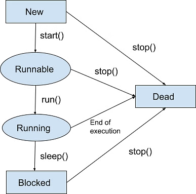
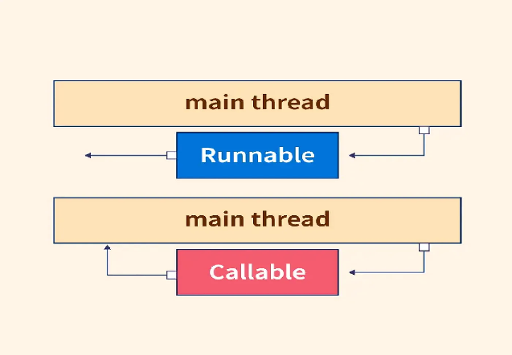
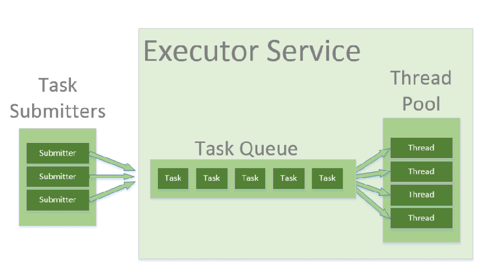

# Concurrency & Threads

## Threads

[https://www.simplilearn.com/tutorials/java-tutorial/thread-in-java](https://www.simplilearn.com/tutorials/java-tutorial/thread-in-java)
[https://medium.com/@AlexanderObregon/beginners-guide-to-java-threads-80ee370b3cb5](https://medium.com/@AlexanderObregon/beginners-guide-to-java-threads-80ee370b3cb5)
[https://www.geeksforgeeks.org/java-threads/](https://www.geeksforgeeks.org/java-threads/)

|  | Process | Thread |
| :---- | :---- | :---- |
| **Definition** | A process is the execution of a program. | A thread is a semi-process. |
| **Creation** | We need to use more than one system call to create more than one process. | We can create more than one thread with one system call. |
| **Termination** | Termination of the process take more compared to thread. | Termination of thread takes less compared to thread. |
| **Communication** | It requires extra mechanisms such as IPC. | It does not require any extra mechanism. |
| **Context switching** | Context switching of processes slower than threads. | Context switching between threads is much faster than processes. |
| **Resource** | Processes may consume more resources since they have separate memory spaces. | Threads may consume fewer resources. |
| **Memory** | Processes are mostly isolated. | Threads share memory. |
| **Sharing** | It requires extra mechanisms such as IPC to share data. | Threads share data with each other. |

## Threads

1. **Improved Application Responsiveness**: By dividing tasks into separate threads, an application can remain responsive to user input even while performing intensive operations. For instance, a user interface can stay active and responsive while another thread performs a long-running calculation or reads data from a file.
2. **Better Resource Utilization**: Threads help in making full use of the processing power available on multi-core processors. By distributing tasks across multiple threads, a program can run more efficiently, completing tasks faster by doing them in parallel.
3. **Simplified Program Structure**: In some scenarios, using threads can simplify the design of a program. For instance, server applications that handle multiple client connections simultaneously can allocate a thread to each connection, making the program easier to understand and manage.
4. **Concurrency Control:** Threads are crucial in applications that require concurrent operations, such as real-time data processing, simulations, and games. They allow developers to create fluid and dynamic interactions by executing multiple operations simultaneously.

**User Thread vs Daemon Thread**

| User Thread | Daemon Thread |
| :---- | :---- |
| [JVM](https://www.geeksforgeeks.org/jvm-works-jvm-architecture/) wait until user threads to finish their work. It never exit until all user threads finish their work. | The JVM will’t wait for daemon threads to finish their work. The JVM will exit as soon as all user threads finish their work. |
| JVM will not force to user threads for terminating, so JVM will wait for user threads to terminate themselves. | If all user threads have finished their work JVM will force the daemon threads to terminate |
| User threads are created by the application. | Mostly Daemon threads created by the JVM. |
| Mainly user threads are designed to do some specific task. | Daemon threads are design as to support the user threads. |
| User threads are foreground threads. | Daemon threads are background threads. |
| User threads are high priority threads. | Daemon threads are low priority threads. |
| Its life independent. | Its life depends on user threads. |

## Life Cycles

1. New
2. Runnable
3. Running
4. Blocked (Non-runnable state)
5. Dead

## Thread Creation

1. ### Extending the Thread Class

   The first method to create a thread is by extending the Thread class. This approach is very direct; your class becomes a thread by inheritance and must override the run method, where you define the code that constitutes the thread's task

   class MyThread extends Thread {
      @Override
      public void run() {
          // Code that runs in the new thread
          System.out.println("The thread is running.");
      }
   }

   public class ThreadExample {
      public static void main(String[] args) {
          MyThread myThread = new MyThread();
          myThread.start(); // Start the thread
      }
   }

2. ### Implementing the Runnable Interface

   The Runnable interface provides an alternative way to define a thread. Instead of extending Thread, your class implements Runnable and its single method, run. This approach allows your class to extend another class if needed. The Runnable object is then passed to a Thread constructor, and the thread is started in the same way as before.

   class MyRunnable implements Runnable {
      @Override
      public void run() {
          // Code that will run in the new thread
          System.out.println("The thread is running.");
      }
   }

   public class RunnableExample {
      public static void main(String[] args) {
          Thread thread = new Thread(new MyRunnable());
          thread.start(); // Start the thread
      }
   }

| Feature | Thread | Runnable |
| :---- | :---- | :---- |
| **Type** | Class | Interface |
| **Inheritance** | Extends Thread class; limits further extension | Implements Runnable interface; allows extending another class |
| **Object Creation** | New object per thread | Single object shared among threads |
| **Flexibility** | Less flexible | More flexible |
| **Reusability** | Limited | Enhanced |

## Starting and Managing Threads

**start()**
Starting a thread is accomplished by calling its start method, which requests the JVM to execute the thread's run method in a new call stack. This allows the thread to run concurrently with other threads, including the main thread.
**run()**
It's important to note that calling the run method directly won't start a new thread; instead, it will run the run method in the current thread, just like any other method call.

## Concurrency Problems

1. **Race Condition:** Occurs when multiple threads access shared data simultaneously, leading to inconsistent results. It happens when the code is not thread-safe.
2. **Deadlock**: Happens when two or more threads are blocked forever, each waiting for the other to release a lock.
3. **Livelock**: Threads are active but unable to make progress because they keep responding to each other in an endless loop.
4. **Thread Starvation**: A thread is perpetually denied access to resources because other threads are given priority.
5. **Priority Inversion**: Occurs when a low-priority thread holds a lock needed by a high-priority thread, blocking its progress.

## Why Synchronization is Necessary

Imagine a scenario where two threads are attempting to update the same bank account balance based on transactions from different sources. If these updates happen simultaneously without any form of control, one thread might overwrite the changes made by the other, resulting in an incorrect account balance. This scenario, known as a race condition, is a common issue in multi-threaded environments where the outcome depends on the sequence or timing of threads’ execution.

### Implementing Synchronization in Java

Java provides several mechanisms for synchronization, including synchronized methods, synchronized blocks, and special concurrent classes from the java.util.concurrent package.

### Synchronized Methods

The simplest way to synchronize access to an instance method of an object is to use the synchronized keyword in the method declaration. This ensures that only one thread can execute the method at a time for a given instance of the class.

public class Counter {
   private int count = 0;

   public synchronized void increment() {
       count++; // Only one thread can execute this at a time per instance
   }

   public int getCount() {
       return count;
   }
}

### Synchronized Blocks

For finer control over synchronization, Java allows the use of synchronized blocks within methods. This allows you to synchronize only the critical section of code that accesses the shared resource, reducing the scope of synchronization to minimize performance overhead.

public void increment() {
   synchronized(this) {
       count++;
   }
}

In this example, the synchronized block ensures that only one thread can execute the increment within the block, even if multiple threads are accessing the same object’s increment method.

## Best Practices for Synchronizing Threads

1. **Minimize Synchronization Overheads**: Synchronize only the critical section of code that accesses shared resources. Unnecessary synchronization can lead to performance degradation.
2. **Avoid Deadlocks**: Ensure that all threads acquire locks in a consistent order and release them promptly to prevent deadlocks, where two or more threads wait indefinitely for each other to release locks.
3. **Prefer java.util.concurrent Utilities**: Whenever possible, use the high-level synchronization utilities provided in the java.util.concurrent package. These utilities are designed for efficiency and ease of use, reducing the risk of common synchronization issues.
4. **Understand the Scope of Synchronization**: Be aware of what object’s monitor you’re synchronizing on. Synchronizing on different objects can lead to unexpected concurrency issues.

## Advanced Threading

[https://dev.to/danielrendox/thread-runnable-callable-executorservice-and-future-all-the-ways-to-create-threads-in-java-2o86](https://dev.to/danielrendox/thread-runnable-callable-executorservice-and-future-all-the-ways-to-create-threads-in-java-2o86)
[https://www.geeksforgeeks.org/future-and-futuretask-in-java/](https://www.geeksforgeeks.org/future-and-futuretask-in-java/)

### Callable Interface

The Java Callable interface, java.util.concurrent.Callable, represents an asynchronous task which can be executed by a separate thread. For instance, it is possible to submit a Callable object to a Java ExecutorService which will then execute it asynchronously.

public interface Callable<V> {
   V call() throws Exception;
}
**Benefits**

1. **Return Value**: The call method returns a value of type V. This allows tasks to return results, which can be useful for complex computations.
2. **Checked Exceptions**: The call method can throw checked exceptions, providing better error-handling capabilities.
3. **Generic Type**: The interface is generic, allowing you to specify the type of the result returned by the call method.

**Example**
public class CallableExample implements Callable<String> {
   @Override
   public String call() throws Exception {
       return "Callable result";
   }
   public static void main(String[] args) {
       ExecutorService executor = Executors.newSingleThreadExecutor();
       Future<String> future = executor.submit(new CallableExample());
       try {
           String result = future.get();
           System.out.println(result);
       } catch (InterruptedException | ExecutionException e) {
           e.printStackTrace();
       }
       executor.shutdown();
   }
}

### Future and FutureTask

**Future**
A Future interface provides methods to check if the computation is complete, to wait for its completion and to retrieve the results of the computation. The result is retrieved using Future’s get() method when the computation has completed, and it blocks until it is completed.

Future<Integer> future = executor.submit(() -> new Random().nextInt());
.
.
// wait for 1 sec and then throw TimeoutException, if it still hasn't finished
future.get(1, TimeUnit.SECONDS);
future.cancel(true);
future.isCancelled();
future.isDone();
.
.
public static void main(String[] args) {
   ExecutorService executor = Executors.newSingleThreadExecutor();
   Future<Integer> future = executor.submit(() -> {
       try {
           Thread.sleep(1000);
       } catch (InterruptedException e) {
           throw new RuntimeException(e);
       }
       return new Random().nextInt();
   });

   try {
       System.out.println("Result: " + future.get(1, TimeUnit.SECONDS));
   } catch (InterruptedException | ExecutionException e) {
       e.printStackTrace();
   } catch (TimeoutException e) {
       System.out.println("Couldn't complete the task before timeout");
   }

   executor.shutdown();
}

**FutureTask**

1. FutureTask is a concrete implementation of the Future, Runnable, and RunnableFuture interfaces and therefore can be submitted to an ExecutorService instance for execution.
2. When calling ExecutorService.submit() on a Callable or Runnable instance, the ExecutorService returns a Future representing the task. and one can create it manually also.
3. FutureTask acts similar to a CountDownLatch when calling get() in that it waits for the task to complete or error out.
4. Behaviour of the parameterless get() method depends on the state of the task. If tasks are not completed, get() method blocks until the task is completed. Once the task complete, it returns the result or throws an ExecutionException.
5. An overloaded variant of get() allows passing a timeout parameter to limit the amount of time the thread waits for a result.

class MyRunnable implements Runnable {
   private final long waitTime;
   public MyRunnable(int timeInMillis)
   {
       this.waitTime = timeInMillis;
   }
   @Override
   public void run()
   {
       try {
           // sleep for user given millisecond
           // before checking again
           Thread.sleep(waitTime);
           // return current thread name
           System.out.println(Thread
                                  .currentThread()
                                  .getName());
       }
       catch (InterruptedException ex) {
           Logger
               .getLogger(MyRunnable.class.getName())
               .log(Level.SEVERE, null, ex);
       }
   }
}
// Class FutureTaskExample execute two future task
class FutureTaskExample {
   public static void main(String[] args)
   {
       // create two object of MyRunnable class
       // for FutureTask and sleep 1000, 2000
       // millisecond before checking again
       MyRunnable myrunnableobject1 = new MyRunnable(1000);
       MyRunnable myrunnableobject2 = new MyRunnable(2000);
       FutureTask<String>
           futureTask1 = new FutureTask<>(myrunnableobject1,
                                          "FutureTask1 is complete");
       FutureTask<String>
           futureTask2 = new FutureTask<>(myrunnableobject2,
                                          "FutureTask2 is complete");
       // create thread pool of 2 size for ExecutorService
       ExecutorService executor = Executors.newFixedThreadPool(2);
       // submit futureTask1 to ExecutorService
       executor.submit(futureTask1);
       // submit futureTask2 to ExecutorService
       executor.submit(futureTask2);
       while (true) {
           try {
               // if both future task complete
               if (futureTask1.isDone() && futureTask2.isDone()) {
                   System.out.println("Both FutureTask Complete");
                   // shut down executor service
                   executor.shutdown();
                   return;
               }
               if (!futureTask1.isDone()) {
                   // wait indefinitely for future
                   // task to complete
                   System.out.println("FutureTask1 output = "
                                      + futureTask1.get());
               }
               System.out.println("Waiting for FutureTask2 to complete");
               // Wait if necessary for the computation to complete,
               // and then retrieves its result
               String s = futureTask2.get(250, TimeUnit.MILLISECONDS);
               if (s != null) {
                   System.out.println("FutureTask2 output=" + s);
               }
           }
           catch (Exception e) {
               System.out.println("Exception: " + e);
           }
       }
   }
}

### Runnable vs Callable

| Feature | Runnable | Callable |
| :---- | :---- | :---- |
| **Method** | run() | call() |
| **Return Value** | void (nothing) | Returns a value of type V |
| **Exceptions** | Cannot throw checked exceptions | Can throw checked exceptions |
| **Usage** | Simple tasks, no return needed | Tasks requiring a return value or exception handling |
| **Execution** | Can be run by Thread or ExecutorService | Can only be executed by ExecutorService |

### Thread Pool

[https://jenkov.com/tutorials/java-util-concurrent/executorservice.html](https://jenkov.com/tutorials/java-util-concurrent/executorservice.html)
[https://www.geeksforgeeks.org/thread-pools-java/](https://www.geeksforgeeks.org/thread-pools-java/)
[https://dev.to/danielrendox/thread-runnable-callable-executorservice-and-future-all-the-ways-to-create-threads-in-java-2o86](https://dev.to/danielrendox/thread-runnable-callable-executorservice-and-future-all-the-ways-to-create-threads-in-java-2o86)

Creating too many threads, for example, 100, is not efficient because only some of them will be scheduled. The rest will wait until the ones that are executing finish their work and die. Only then will they take their place. In addition, many threads consume lots of time and resources being born and dying.

That’s why, you should prefer thread pools over multiple instances of Thread. This way allows us to create a reasonable number of threads that will not die as long as they have done an operation, they will switch to another one instead. And this is how to do it

**Types**
ExecutorService executorService1 = Executors.newSingleThreadExecutor();

ExecutorService executorService2 = Executors.newFixedThreadPool(10);

ExecutorService executorService3 = Executors.newScheduledThreadPool(10);

**Example**
ExecutorService executorService = Executors.newFixedThreadPool(threadsNumber);
for (int i = 0; i < 20; i++) {
   executorService.submit(() -> System.out.println("Hello from: " + Thread.currentThread().getName()));
}
executorService.submit(() -> System.out.println("Another task executed by " + Thread.currentThread().getName()));
executorService.shutdown();

One of the main advantages of using this approach is when you want to process 100 requests at a time, but do not want to create 100 Threads for the same, so as to reduce JVM overload. You can use this approach to create a ThreadPool of 10 Threads and you can submit 100 requests to this ThreadPool.
ThreadPool will create maximum of 10 threads to process 10 requests at a time.  After process completion of any single Thread,
ThreadPool will internally allocate the 11th request to this Thread
and will keep on doing the same to all the remaining requests.

**Risks in using Thread Pools**

1. **Deadlock** : While deadlock can occur in any multi-threaded program, thread pools introduce another case of deadlock, one in which all the executing threads are waiting for the results from the blocked threads waiting in the queue due to the unavailability of threads for execution.
2. **Thread Leakage** :Thread Leakage occurs if a thread is removed from the pool to execute a task but not returned to it when the task completed. As an example, if the thread throws an exception and pool class does not catch this exception, then the thread will simply exit, reducing the size of the thread pool by one. If this repeats many times, then the pool would eventually become empty and no threads would be available to execute other requests.
3. **Resource Thrashing** :If the thread pool size is very large then time is wasted in context switching between threads. Having more threads than the optimal number may cause starvation problem leading to resource thrashing as explained.

## IPC - Inter-Process Communication

[https://www.baeldung.com/java-ipc](https://www.baeldung.com/java-ipc)
[https://www.geeksforgeeks.org/inter-process-communication-ipc/](https://www.geeksforgeeks.org/inter-process-communication-ipc/)

## Types of Process

Let us first talk about types of types of processes.

1. **Independent process:** An independent process is not affected by the execution of other processes. Independent processes are processes that do not share any data or resources with other processes. No inter-process communication required here.
2.
3. **Co-operating process:** Interact with each other and share data or resources. A co-operating process can be affected by other executing processes. Inter-process communication (IPC) is a mechanism that allows processes to communicate with each other and synchronize their actions. The communication between these processes can be seen as a method of cooperation between them.

## Inter Process Communication

Inter process communication (IPC) allows different programs or processes running on a computer to share information with each other. IPC allows processes to communicate by using different techniques like sharing memory, sending messages, or using files. It ensures that processes can work together without interfering with each other. Cooperating processes require an Inter Process Communication (IPC) mechanism that will allow them to exchange data and information.

The two fundamental models of Inter Process Communication are:

1. **Shared Memory**
2. **Message Passing**
