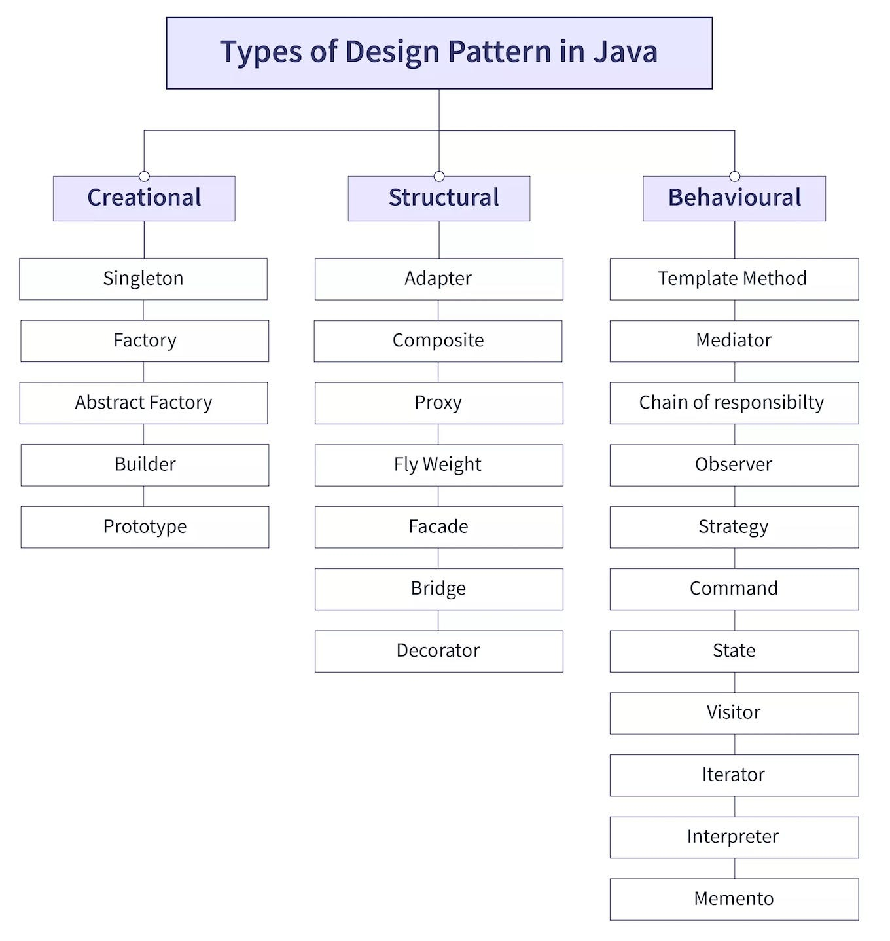

# Design Patterns

[https://refactoring.guru/design-patterns/java](https://refactoring.guru/design-patterns/java)
[https://vmsoftwarehouse.com/the-10-most-popular-types-of-design-patterns-in-java](https://vmsoftwarehouse.com/the-10-most-popular-types-of-design-patterns-in-java)
[https://www.digitalocean.com/community/tutorials/java-design-patterns-example-tutorial](https://www.digitalocean.com/community/tutorials/java-design-patterns-example-tutorial)

1. ### Creational  Design Pattern

   1. **Singleton Pattern**
      Ensures that a class has only one instance and provides a global point of access to that instance. This is useful when exactly one object is needed to coordinate actions across the system.

   Example:

      public class Singleton {
         private static Singleton instance;

         private Singleton() {}

         public static Singleton getInstance() {
             if (instance == null) {
                 instance = new Singleton();
             }
             return instance;
         }
      }

   2. **Factory Method Pattern**
      Defines an interface for creating objects, but allows subclasses to alter the type of objects that will be created.
      Example:
      public interface Shape {
         void draw();
      }

      public class Circle implements Shape {
         @Override
         public void draw() {
             System.out.println("Drawing Circle");
         }
      }

      public class Rectangle implements Shape {
         @Override
         public void draw() {
             System.out.println("Drawing Rectangle");
         }
      }

      public interface ShapeFactory {

         Shape createShape();

      }

      public class CircleFactory implements ShapeFactory {

         @Override

         public Shape createShape() {

             return new Circle();

         }

      }

      public class RectangleFactory implements ShapeFactory {

         @Override

         public Shape createShape() {

             return new Rectangle();

         }

      }

   3. **Abstract Factory Pattern**
      Provides an interface for creating families of related or dependent objects without specifying their concrete classes.
      Example:
      public interface Button {
         void paint();
      }

      public interface Checkbox {
         void paint();
      }

      public interface GUIFactory {
         Button createButton();
         Checkbox createCheckbox();
      }

      public class WinFactory implements GUIFactory {
         @Override
         public Button createButton() {
             return new WinButton();
         }

         @Override
         public Checkbox createCheckbox() {
             return new WinCheckbox();
         }
      }

      public class MacFactory implements GUIFactory {
         @Override
         public Button createButton() {
             return new MacButton();
         }

         @Override
         public Checkbox createCheckbox() {
             return new MacCheckbox();
         }
      }

   4. **Prototype Pattern**
      The Prototype Pattern is a creational design pattern that allows objects to be created by cloning existing objects, known as prototypes, rather than by creating them from scratch. This pattern is particularly useful when the construction of an object is costly or complex and when the new objects share a lot of common properties with existing objects.

1. **Prototype Interface:** Define an interface or abstract class that declares a method for cloning itself.
2. **Concrete Prototypes:** Implement the Prototype interface or extend the abstract class to create concrete prototype classes. These classes must provide a method to clone themselves.
3. **Client:** The client creates new objects by cloning the prototypes instead of instantiating them directly.

   // Step 1: Prototype Interface

   interface Prototype {

      Prototype clone();

   }

   // Step 2: Concrete Prototypes

   class ConcretePrototype implements Prototype {

      private int value;

      public ConcretePrototype(int value) {

          this.value = value;

      }

      public void setValue(int value) {

          this.value = value;

      }

      @Override

      public Prototype clone() {

          // Create a new object with the same state

          return new ConcretePrototype(this.value);

      }

      @Override

      public String toString() {

          return "ConcretePrototype [value=" + value + "]";

      }

   }

   // Step 3: Client

   public class Client {

      public static void main(String[] args) {

          // Create a prototype object

          Prototype prototype = new ConcretePrototype(10);

          // Clone the prototype to create a new object

          Prototype clone = prototype.clone();

          // Output the clone

          System.out.println(clone);

      }

   }

   In this example, ConcretePrototype implements the Prototype interface and provides a method clone() to create a new object with the same state. The client creates a prototype object and then clones it to obtain a new object without the need for direct instantiation.

   5. **Builder Pattern**
      The Builder Pattern is a creational design pattern that is used to construct complex objects step by step. It separates the construction of a complex object from its representation, allowing the same construction process to create different representations.

1. **Product**: Define the complex object that the builder will construct. This could be a class with many attributes and configurations.
2. **Builder Interface** (Optional): Define an interface for creating parts of the product. This is optional, especially if you have a single concrete builder.
3. **Concrete Builders**: Implement the builder interface or directly create concrete builder classes. These classes contain methods for configuring different parts of the product.
4. **Director** (Optional): Construct the product using a builder. This step is optional and can be omitted if you prefer to let the client directly interact with the builder.
5. **Client**: Use the builder to construct the product, either through the director or directly.

   // Step 1: Product

   class Pizza {

      private String dough;

      private String sauce;

      private String topping;

      public void setDough(String dough) {

          this.dough = dough;

      }

      public void setSauce(String sauce) {

          this.sauce = sauce;

      }

      public void setTopping(String topping) {

          this.topping = topping;

      }

      @Override

      public String toString() {

          return "Pizza [dough=" + dough + ", sauce=" + sauce + ", topping=" + topping + "]";

      }

   }

   // Step 2: Builder Interface

   interface PizzaBuilder {

      void buildDough();

      void buildSauce();

      void buildTopping();

      Pizza getPizza();

   }

   // Step 3: Concrete Builders

   class HawaiianPizzaBuilder implements PizzaBuilder {

      private Pizza pizza;

      public HawaiianPizzaBuilder() {

          this.pizza = new Pizza();

      }

      @Override

      public void buildDough() {

          pizza.setDough("Pan crust");

      }

      @Override

      public void buildSauce() {

          pizza.setSauce("Tomato sauce");

      }

      @Override

      public void buildTopping() {

          pizza.setTopping("Ham and pineapple");

      }

      @Override

      public Pizza getPizza() {

          return pizza;

      }

   }

   // Step 4: Director (Optional)

   class PizzaDirector {

      private PizzaBuilder pizzaBuilder;

      public PizzaDirector(PizzaBuilder pizzaBuilder) {

          this.pizzaBuilder = pizzaBuilder;

      }

      public void makePizza() {

          pizzaBuilder.buildDough();

          pizzaBuilder.buildSauce();

          pizzaBuilder.buildTopping();

      }

   }

   // Step 5: Client

   public class Client {

      public static void main(String[] args) {

          PizzaBuilder builder = new HawaiianPizzaBuilder();

          PizzaDirector director = new PizzaDirector(builder);

          director.makePizza();

          Pizza pizza = builder.getPizza();

          System.out.println(pizza);

      }

   }

   In this example, Pizza is the product that we want to build. We have a PizzaBuilder interface with methods to build different parts of the pizza. We then have a concrete builder HawaiianPizzaBuilder that implements the builder interface and provides methods to build a Hawaiian pizza. Optionally, we have a director PizzaDirector that orchestrates the construction process. Finally, in the client code, we use the builder to construct the pizza, either directly or through the director.

2. ### Structural Design Pattern ?

**Adapter Pattern**

**Bridge Pattern**

**Composite Pattern**

**Decorator Pattern**

**Facade Pattern**

**Flyweight Pattern**

**Proxy Pattern**

3. ### Behavioral Design Pattern ?

   **Chain Of Responsibility Pattern**

   **Command Pattern**

   **Interpreter Pattern**

   **Iterator Pattern**

   **Mediator Pattern**

   **Memento Pattern**

   **Observer Pattern**

   **State Pattern**

   **Strategy Pattern**

   **Template Pattern**

   **Visitor Pattern**

?? [https://www.digitalocean.com/community/tutorials/java-singleton-design-pattern-best-practices-examples](https://www.digitalocean.com/community/tutorials/java-singleton-design-pattern-best-practices-examples)

[https://medium.com/@minadev/solving-everyday-problems-essential-java-design-patterns-you-need-to-know-01dba2939b45](https://medium.com/@minadev/solving-everyday-problems-essential-java-design-patterns-you-need-to-know-01dba2939b45)

[https://www.geeksforgeeks.org/dependency-injection-di-design-pattern/](https://www.geeksforgeeks.org/dependency-injection-di-design-pattern/)

[https://medium.com/groupon-eng/dependency-injection-in-java-9e9438aa55ae](https://medium.com/groupon-eng/dependency-injection-in-java-9e9438aa55ae)
