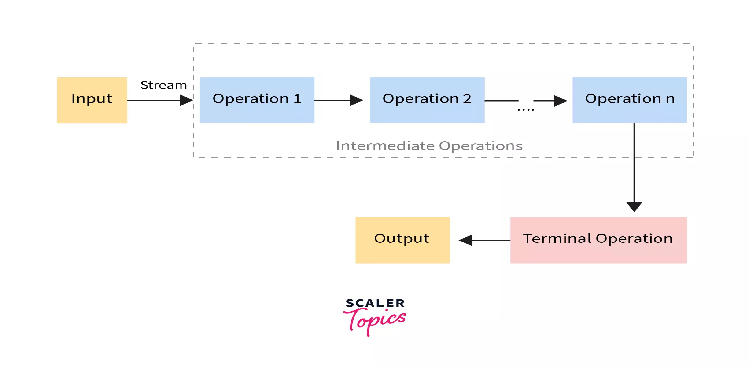

# Functional Java (Lambdas & Streams)

## Lambda Expressions

**(argument) -> (body)**

Before Java 8, we would usually create a class for every case where we needed to encapsulate a single piece of functionality. This implied a lot of unnecessary boilerplate code to define something that served as a primitive function representation.

A lambda expression is a short block of code which takes in parameters and returns a value. Lambda expressions are similar to methods, but they do not need a name and they can be implemented right in the body of a method.

* Enable to treat functionality as a method argument, or code as data.
* A function that can be created without belonging to any class.
* A lambda expression can be passed around as if it was an object and executed on demand.

**Java lambda functions can be only used with functional interfaces.Lambda expressions are just like functions and they accept parameters just like functions.**

**Advantages**

* Reduced Lines of Code
* Sequential and Parallel Execution Support
* Passing Behaviors into methods
* Higher Efficiency with Laziness

There are three Lambda Expression Parameters

1. Zero Parameter
   () -> System.out.println("Zero parameter lambda");

2. Single Parameter
   (p) -> System.out.println("One parameter: " + p);

3. Multiple Parameters
   (p1, p2) -> System.out.println("Multiple parameters: " + p1 + ", " + p2);

Eg:
interface StringFunction {
   String run(String str);
 }
  public class Main {
   public static void main(String[] args) {
     StringFunction exclaim = (s) -> s + "!";
     StringFunction ask = (s) -> s + "?";
     printFormatted("Hello", exclaim);
     printFormatted("Hello", ask);
   }
   public static void printFormatted(String str, StringFunction format) {
     String result = format.run(str);
     System.out.println(result);
   }
 }
—-----------------------------------------------------------------------------
//Traditional approach
private static boolean isPrime(int number) {
   if(number < 2) return false;
   for(int i=2; i<number; i++){
       if(number % i == 0) return false;
   }
   return true;
}

//Declarative approach
private static boolean isPrime(int number) {
   return number > 1
           && IntStream.range(2, number).noneMatch(
                   index -> number % index == 0);
}
private static boolean isPrime(int number) {
   IntPredicate isDivisible = index -> number % index == 0;

   return number > 1
           && IntStream.range(2, number).noneMatch(
                   isDivisible);
}
—-----------------------------------------------------------------------------
public static int sumWithCondition(List<Integer> numbers, Predicate<Integer> predicate) {
   return numbers.parallelStream()
           .filter(predicate)
           .mapToInt(i -> i)
           .sum();
}

//sum of all numbers
sumWithCondition(numbers, n -> true)
//sum of all even numbers
sumWithCondition(numbers, i -> i%2==0)
//sum of all numbers greater than 5
sumWithCondition(numbers, i -> i>5)

### Double Colon (::) Operator

**<Class name>::<method name>**

The double colon (::) operator, also known as method reference operator in Java, is used to call a **method by referring** to it with the help of its class directly. They behave exactly as the lambda expressions. The only difference it has from lambda expressions is that this uses **direct reference to the method** by name instead of providing a delegate to the method.

There are four kinds of method references:

* Reference to a static method ClassName::staticMethodName
* Reference to an instance method of a particular object Object::instanceMethodName
* Reference to an instance method of an arbitrary object of a particular type ContainingType::methodName–
* Reference to a constructor ClassName::new

* (ClassName::methodName)
* (objectOfClass::methodName)
* (super::methodName)
* (ClassName::methodName)
* (ClassName::new)

Eg:

* **System::getProperty**
* **System.out::println**
* **"abc"::length**
* **ArrayList::new**
* **Int[]::new**

### Functional Interfaces

Any interface with a **SAM(Single Abstract Method)** is a functional interface, and its implementation may be treated as lambda expressions. A functional interface can have any number of default methods.
Eg:

* **Runnable** –> This interface only contains the run() method.
* **Comparable** –> This interface only contains the compareTo() method.
* **ActionListener** –> This interface only contains the actionPerformed() method.
* **Callable** –> This interface only contains the call() method.

Functional interfaces are included in Java SE 8 with Lambda expressions and Method references in order to make code more readable, clean, and straightforward. Functional interfaces are interfaces that ensure that they include precisely only one abstract method. Functional interfaces are used and executed by representing the interface with an annotation called **@FunctionalInterface**. Functional interfaces can contain only one abstract method. However, they can include any quantity of default and static methods.

**Four main kinds of functional interfaces**

1. **Consumer**
   Consumer<Integer> consumer = (value) -> System.out.println(value);

   List<String> names = Arrays.asList("John", "Freddy", "Samuel");
   names.forEach(name -> System.out.println("Hello, " + name));

2. **Predicate**
   public interface Predicate<T> {
      boolean test(T t);
   }

   List<String> names = Arrays.asList("Angela", "Aaron", "Bob", "Claire", "David");

   List<String> namesWithA = names.stream()
    .filter(name -> name.startsWith("A"))
    .collect(Collectors.toList());

3. **Function**
   @FunctionalInterface
   public interface BiFunction<T, U, R>
   {
     R apply(T t, U u);
      .......
   }

   Map<String, Integer> nameMap = new HashMap<>();
   Integer value = nameMap.computeIfAbsent("John", s -> s.length());

4. **Supplier**
   @FunctionalInterface
   public interface Supplier<T>{
   // gets a result
   ………….
   // returns the specific result
   …………
   T.get();
   }

### BI Function

**REF**

1. [https://www.baeldung.com/java-8-functional-interfaces](https://www.baeldung.com/java-8-functional-interfaces)
2. [https://www.digitalocean.com/community/tutorials/java-8-functional-interfaces](https://www.digitalocean.com/community/tutorials/java-8-functional-interfaces)
3. [https://www.baeldung.com/java-bifunction-interface](https://www.baeldung.com/java-bifunction-interface)

**REF**

1. [https://stackify.com/streams-guide-java-8/](https://stackify.com/streams-guide-java-8/)
2. [https://www.geeksforgeeks.org/stream-in-java/](https://www.geeksforgeeks.org/stream-in-java/)
3. [https://www.baeldung.com/java-8-streams\](https://www.baeldung.com/java-8-streams\)
4. [https://www.scaler.com/topics/java/streams-in-java/](https://www.scaler.com/topics/java/streams-in-java/)
5. [https://www.geeksforgeeks.org/comparing-streams-to-loops-in-java/](https://www.geeksforgeeks.org/comparing-streams-to-loops-in-java/)

## Java Streams

* **Terminal operations** in Java Streams are the operations that produce a final result or a side-effect
* **Intermediate operations** in Java Streams allow you to transform or filter the elements of a stream in a lazy manner.

* Streams are wrappers around a data source, allowing us to operate with that data source and making bulk processing convenient and fast.

* A stream does not store data and, in that sense, is not a data structure. It also never modifies the underlying data source.

* Streams don’t change the original data structure, they only provide the result as per the pipelined methods.

* Each intermediate operation is lazily executed and returns a stream as a result, hence various intermediate operations can be pipelined. Terminal operations mark the end of the stream and return the result.

* A stream pipeline consists of a stream source, followed by zero or more intermediate operations, and a terminal operation.

* Computation on the source data is only performed when the terminal operation is initiated, and source elements are consumed only as needed.

* All intermediate operations are lazy, so they’re not executed until a result of a processing is actually needed.

Streams offer several advantages over traditional iteration approaches in Java programming:

* **Declarative Style**: Streams allow you to express your data processing logic in a more declarative and functional style. This leads to more concise, readable, and expressive code.

* **Method Chaining**: Streams support method chaining, enabling you to perform multiple operations (such as filtering, mapping, and reducing) in a single pipeline. This promotes code organization and reduces the need for intermediate variables.

* **Lazy Evaluation**: Stream operations are lazy by default, meaning they only process elements as needed. This can lead to improved performance, especially when working with large or infinite data sets, as unnecessary computation is avoided.

* **Parallelism**: Streams can easily be parallelized to leverage multi-core processors, using the parallel() method. This allows for concurrent processing of elements, potentially improving throughput and reducing execution time.

* **Immutable State:** Streams operate on immutable data, meaning they do not modify the original source data. This promotes thread safety and reduces the likelihood of unintended side effects.

* **Separation of Concerns**: Streams separate the definition of data processing operations from the mechanics of iteration. This separation of concerns enhances modularity, testability, and maintainability of your code.

* **Functional Programming Constructs**: Streams provide a range of functional programming constructs such as map, filter, reduce, and forEach, which align well with modern programming paradigms and facilitate functional programming techniques.

* **Support for Sequential and Parallel Processing**: Streams provide a consistent API for sequential and parallel processing, allowing you to switch between the two modes seamlessly without changing your code's logic.

* **Integration with Existing APIs:** Streams integrate seamlessly with existing Java APIs, such as Collections, I/O operations, and concurrency utilities, allowing for interoperability and code reuse.

Overall, streams enable more efficient, concise, and expressive data processing in Java, making it easier to write robust, scalable, and maintainable applications.

### Stream Creation

In Java, you can create streams from various data sources, including collections, arrays, I/O resources, and numerical ranges

1. **Stream.builder()**
   When builder is used, the desired type should be additionally specified in the right part of the statement, otherwise the build() method will create an instance of the Stream<Object>:

Stream<String> streamBuilder =
Stream.<String>builder().add("a").add("b").add("c").build();

2. **From a Collection**
* Collection.stream(): Creates a stream from a collection.
* Collection.parallelStream(): Creates a parallel stream from a collection.

List<String> list = Arrays.asList("apple", "banana", "cherry");
Stream<String> stream = list.stream();

3. **From an Array**
* Arrays.stream(array): Creates a stream from an array.
* Arrays.stream(array, fromIndex, toIndex): Creates a stream from a subarray.

String[] array = { "apple", "banana", "cherry" };
Stream<String> stream = Arrays.stream(array);

4. **From Static Factory Methods**
* Stream.of(T... values): Creates a stream from the specified values.
* Stream.empty(): Creates an empty stream.

Stream<String> stream = Stream.of("apple", "banana", "cherry");

5. **From I/O Resources**
* Files.lines(Path): Creates a stream of lines from a file.
* BufferedReader.lines(): Creates a stream of lines from a buffered reader.

try (Stream<String> stream = Files.lines(Paths.get("file.txt"))) {
   // Process the lines
} catch (IOException e) {
   e.printStackTrace();
}

6. **From Primitive Arrays**
* IntStream.range(int startInclusive, int endExclusive): Creates a stream of integers within the specified range.
* LongStream.range(long startInclusive, long endExclusive): Creates a stream of longs within the specified range.
* DoubleStream.of(double... values): Creates a stream of doubles from the specified values.

IntStream intStream = IntStream.range(1, 10);

7. **From Iterative Constructs**
* Stream.iterate(T seed, UnaryOperator<T> f): Creates an infinite stream where each element is generated by applying the given function to the previous element.
* Stream.generate(Supplier<T> s): Creates an infinite stream where each element is generated by invoking the given supplier.

Stream<Integer> stream = Stream.iterate(0, n -> n + 2);

8. **Stream.generate()**
   The generate() method accepts a Supplier<T> for element generation. As the resulting stream is infinite, the developer should specify the desired size, or the generate() method will work until it reaches the memory limit:

Stream<String> streamGenerated = Stream.generate(() -> "element").limit(10);
The code above creates a sequence of ten strings with the value “element.”

### Intermediate operations

Intermediate operations in Java Streams allow you to transform or filter the elements of a stream in a lazy manner.

1. **filter(Predicate)**
   Filters the elements of the stream based on a given predicate.

stream.filter(x -> x > 5)

2. **map(Function)**

Transforms each element of the stream using the provided function.
stream.map(x -> x \* x)

3. **flatMap(Function)**
   Flattens the elements of nested streams into a single stream.

stream.flatMap(list -> list.stream())

4. **distinct()**

Removes duplicate elements from the stream.
stream.distinct()

5. **sorted()**
   Sorts the elements of the stream in natural order.
   **stream.sorted()**

6. **sorted(Comparator)**
   Sorts the elements of the stream using the provided comparator.
   stream.sorted((a, b) -> a.compareTo(b))

7. **limit(long)**:
   Limits the number of elements in the stream to the specified maximum size.
   stream.limit(10)

8. **skip(long):**
   Skips the specified number of elements from the beginning of the stream.
   stream.skip(5)

9. **peek(Consumer):**
   Allows performing a side-effect operation on each element of the stream without changing the elements themselves.

stream.peek(System.out::println)

10. **takeWhile(Predicate) (Java 9+):**

Takes elements from the stream while the predicate holds true.
stream.takeWhile(x -> x < 5)

11. **dropWhile(Predicate) (Java 9+):**

Drops elements from the stream while the predicate holds true, and returns the rest.
stream.dropWhile(x -> x < 5)

12. **unordered():**

Disables the ordering of elements in the stream.
stream.unordered()

### Terminal operations

Terminal operations in Java Streams are the operations that produce a final result or a side-effect.

1. **forEach(Consumer)**
   Performs an action for each element of the stream.
   stream.forEach(System.out::println)

2. **collect(Collector)**

Accumulates the elements of the stream into a collection or other data structure.
List<String> list = stream.collect(Collectors.toList())

3. **count()**

Returns the count of elements in the stream as a long.
long count = stream.count()

4. **anyMatch(Predicate)**

Returns true if any element of the stream matches the given predicate; otherwise, returns false.
boolean anyMatch = stream.anyMatch(x -> x > 5)

5. **allMatch(Predicate)**

Returns true if all elements of the stream match the given predicate; otherwise, returns false.
boolean allMatch = stream.allMatch(x -> x > 0)

6. **noneMatch(Predicate):**
   Returns true if none of the elements of the stream match the given predicate; otherwise, returns false.

boolean noneMatch = stream.noneMatch(x -> x < 0)

7. **findFirst()**
   Returns an Optional containing the first element of the stream, or an empty Optional if the stream is empty.

Optional<String> first = stream.findFirst()

8. **findAny()**
   Returns an Optional containing any element of the stream, or an empty Optional if the stream is empty.

Optional<String> any = stream.findAny()

9. **reduce(BinaryOperator)**
   Combines the elements of the stream using the specified binary operator.

int sum = stream.reduce(0, (a, b) -> a + b)

10. **min(Comparator)**
    Returns the minimum element of the stream according to the provided comparator, or an empty Optional if the stream is empty.

Optional<Integer> min = stream.min(Comparator.naturalOrder())

11. **max(Comparator):**
    Returns the maximum element of the stream according to the provided comparator, or an empty Optional if the stream is empty.
    Optional<Integer> max = stream.max(Comparator.naturalOrder())

12. **toArray():**
    Collects the elements of the stream into an array.

String[] array = stream.toArray(String[]::new)

These terminal operations trigger the evaluation of the stream and produce a final result or perform a side-effect. Once a terminal operation is called on a stream, the stream cannot be reused.

### Java Collectors

Collectors is one of the utility class in JDK which contains a lot of utility functions. It is mostly used with Stream API as a final step.

| Collectors | Example |
| :---- | :---- |
| **toList()** | List<Integer> integers = Arrays.asList(1,2,3,4,5,6,6); integers.stream().map(x -> x\*x).collect(Collectors.toList()); // output: [1,4,9,16,25,36,36]  |
| **toSet()** | List<Integer> integers = Arrays.asList(1,2,3,4,5,6,6); integers.stream().map(x -> x\*x).collect(Collectors.toSet()); // output: [1,4,9,16,25,36]  |
| **toCollection()** | List<Integer> integers = Arrays.asList(1,2,3,4,5,6,6); integers    .stream()    .filter(x -> x >2)    .collect(Collectors.toCollection(LinkedList::new)); // output: [3,4,5,6,6]  |
| **Counting()** | List<Integer> integers = Arrays.asList(1,2,3,4,5,6,6); Long collect = integers                   .stream()                   .filter(x -> x <4)                   .collect(Collectors.counting()); // output: 3  |
| **toMap()**  | List<String> strings = Arrays.asList("alpha","beta","gamma"); Map<String,Integer> map = strings       .stream()       .collect(Collectors          .toMap(Function.identity(),String::length)); // output: {alpha=5, beta=4, gamma=5}  |
| **joining()** | List<String> strings = Arrays.asList("alpha","beta","gamma"); String collect3 = strings     .stream()     .distinct()     .collect(Collectors.joining(",")); // output: alpha,beta,gamma String collect4 = strings     .stream()     .map(s -> s.toString())     .collect(Collectors.joining(",","[","]")); // output: [alpha,beta,gamma]  |
| **groupingBy()**  | List<String> strings = Arrays.asList("alpha","beta","gamma"); Map<Integer, List<String>> collect = strings          .stream()          .collect(Collectors.groupingBy(String::length)); // output: {4=[beta], 5=[alpha, gamma]}  //It will make the string length as key and a list of strings of that length as the value.  List<String> strings = Arrays.asList("alpha","beta","gamma"); Map<Integer, LinkedList<String>> collect1 = strings            .stream()            .collect(Collectors.groupingBy(String::length,                Collectors.toCollection(LinkedList::new))); // output: {4=[beta], 5=[alpha, gamma]}  |
| **minBy()** | List<Integer> integers = Arrays.asList(1,2,3,4,5,6,6); List<String> strings = Arrays.asList("alpha","beta","gamma"); integers    .stream()    .collect(Collectors.minBy(Comparator.naturalOrder()))    .get(); // output: 1 strings   .stream()   .collect(Collectors.minBy(Comparator.naturalOrder()))   .get(); // output: alpha  // It will return 1 and alpha, as per the natural order of integers and string. //We can reverse the order using reverseOrder() method.  List<Integer> integers = Arrays.asList(1,2,3,4,5,6,6); List<String> strings = Arrays.asList("alpha","beta","gamma"); integers    .stream()    .collect(Collectors.minBy(Comparator.reverseOrder()))    .get(); // output: 6 strings   .stream()   .collect(Collectors.minBy(Comparator.reverseOrder()))   .get(); // output: gamma // We can have a custom comparator for the user-defined objects. |
| **maxBy()**  | List<String> strings = Arrays.asList("alpha","beta","gamma"); strings   .stream()   .collect(Collectors.maxBy(Comparator.naturalOrder()))   .get(); // output: gamma // All the comparator logic which were there in minBy() also apply to maxBy(). |
| **partitioningBy()**  | List<String> strings = Arrays.asList("a","alpha","beta","gamma"); Map<Boolean, List<String>> collect1 = strings          .stream()          .collect(Collectors.partitioningBy(x -> x.length() > 2)); // output: {false=[a], true=[alpha, beta, gamma]}  |
| **toUnmodifiableList()**  | List<String> strings = Arrays.asList("alpha","beta","gamma"); List<String> collect2 = strings       .stream()       .collect(Collectors.toUnmodifiableList()); // output: ["alpha","beta","gamma"]  |
| **toUnmodifiableSet()** | List<String> strings = Arrays.asList("alpha","beta","gamma","alpha"); Set<String> readOnlySet = strings       .stream()       .sorted()       .collect(Collectors.toUnmodifiableSet()); // output: ["alpha","beta","gamma"]  |
| **averagingLong()**  | List<Long> longValues = Arrays.asList(100l,200l,300l); Double d1 = longValues    .stream()    .collect(Collectors.averagingLong(x -> x \* 2)); // output: 400.0 // NOTE: It will return a Double value, not a long value. |
| **averagingInt()**  | List<Integer> integers = Arrays.asList(1,2,3,4,5,6,6); Double d2 = integers    .stream()    .collect(Collectors.averagingInt(x -> x\*2)); // output: 7.714285714285714 //NOTE: It will also return a Double value, not an int value.   |
| **averagingDouble()**  | List<Double> doubles = Arrays.asList(1.1,2.0,3.0,4.0,5.0,5.0); Double d3 = doubles    .stream()    .collect(Collectors.averagingDouble(x -> x)); // output: 3.35 |
| **summarizingInt()**  | List<Integer> integers = Arrays.asList(1,2,3,4,5,6,6); IntSummaryStatistics stats = integers          .stream()          .collect(Collectors.summarizingInt(x -> x )); //output: IntSummaryStatistics{count=7, sum=27, min=1, average=3.857143, max=6} //Now we can extract different values using get methods like:  stats.getAverage();   // 3.857143 stats.getMax();       // 6 stats.getMin();       // 1 stats.getCount();     // 7 stats.getSum();       // 27  |
| **summingInt()**  | List<String> strings = Arrays.asList("alpha","beta","gamma"); Integer collect4 = strings      .stream()      .collect(Collectors.summingInt(String::length)); // output: 18 // or direct list value sum List<Integer> integers = Arrays.asList(1,2,3,4,5,6,6); Integer sum = integers    .stream()    .collect(Collectors.summingInt(x -> x)); // output: 27  |
| **summingDouble()** | List<Double>  doubleValues = Arrays.asList(1.1,2.0,3.0,4.0,5.0,5.0); Double sum = doubleValues     .stream()     .collect(Collectors.summingDouble(x ->x)); // output: 20.1  |
| **summingLong()** | List<Long> longValues = Arrays.asList(100l,200l,300l); Long sum = longValues    .stream()    .collect(Collectors.summingLong(x ->x)); // output: 600  |

### Comparisons

| Advantages of Streams  | Advantages of Loops  |
| :---- | :---- |
| Streams are a more declarative style. Or a more expressive style. | Performance: A for loop through an array is extremely lightweight both in terms of heap and CPU usage. If raw speed and memory thriftiness is a priority, using a stream is worse. |
| Streams have a strong affinity with functions. Java 8 introduces lambdas and functional interfaces, which opens a whole toolbox of powerful techniques. Streams provide the most convenient and natural way to apply functions to sequences of objects. | Familiarity: The world is full of experienced procedural programmers, from many language backgrounds, for whom loops are familiar and streams are novel. In some environments, you want to write code that’s familiar to that kind of person. |
| Streams encourage less mutability. This is sort of related to the functional programming aspect i.e., the kind of programs we write using streams tend to be the kind of programs where we don’t modify objects. | Cognitive overhead: Because of its declarative nature, and increased abstraction from what’s happening underneath, you may need to build a new mental model of how code relates to execution. Actually, you only need to do this when things go wrong, or if you need to deeply analyze performance or subtle bugs. When it “just works”, it just works. |
| Streams encourage loose coupling. Our stream-handling code doesn’t need to know the source of the stream or its eventual terminating method. | Debuggers are improving, but even now, when we are stepping through stream code in a debugger, it can be harder work than the equivalent loop, because a simple loop is very close to the variables and code locations that a traditional debugger works with. |
| Streams can succinctly express quite sophisticated behavior. |  |

| Sequential Stream | Parallel Stream |
| :---- | :---- |
| Runs on a single-core of the computer | Utilize the multiple cores of the computer.  |
| Performance is poor | The performance is high.  |
| Order is maintained  | Doesn’t care about the order,  |
| Only a single iteration at a time just like the for-loop.   | Operates multiple iterations simultaneously in different available cores.  |
| Each iteration waits for currently running one to finish,  | Waits only if no cores are free or available at a given time,  |
| More reliable and less error,  | Less reliable and error-prone.   |
| Platform independent, | Platform dependent |

### Questions

1. **What is a Stream in Java?**
   * Answer: A Stream in Java is a sequence of elements supporting sequential and parallel aggregate operations. It is not a data structure but a view of the data that can be manipulated using functional-style operations.
2. **How do you create a Stream in Java?**
   * Answer: Streams can be created from various sources, such as Collections, Arrays, or I/O channels. Examples include Stream.of(), Collection.stream(), Arrays.stream(), and Files.lines().
3. **What are the differences between a Stream and a Collection?**
   * Answer: Collections store data, while Streams are used to process data. Collections are eagerly constructed, whereas Streams are lazily constructed and can be infinite. Streams do not store elements; instead, they convey elements from a source to a pipeline of operations.

4. **Explain the difference between intermediate and terminal operations in a Stream.**
   * Answer: Intermediate operations return a new Stream and are lazy, meaning they are not executed until a terminal operation is invoked. Examples include filter(), map(), and sorted(). Terminal operations produce a result or a side effect and trigger the processing of the stream. Examples include forEach(), collect(), and reduce().
5. **What is the purpose of the filter() method in a Stream?**
   * Answer: The filter() method is an intermediate operation that allows you to exclude elements from a Stream based on a given predicate. Only elements that satisfy the predicate are included in the resulting Stream.
6. **How does the map() method work in a Stream?**
   * Answer: The map() method is an intermediate operation that applies a function to each element of the Stream, transforming each element into another form, and returns a new Stream with the transformed elements.
7. **What is the difference between map() and flatMap()?**
   * Answer: map() applies a function to each element and returns a Stream of the results.
   * flatMap() applies a function that returns a Stream for each element and then flattens the resulting Streams into a single Stream. flatMap() is used for transforming and flattening elements.

8. **What is the purpose of the reduce() method, and how does it work?**
   * Answer: The reduce() method is a terminal operation that performs a reduction on the elements of the Stream using an associative accumulation function and returns an Optional. It combines elements of the Stream to produce a single result, such as summing a list of numbers.
9. **How do you handle parallel processing with Streams?**
   * Answer: Parallel processing can be achieved by calling the parallelStream() method on a Collection or the parallel() method on a Stream. This divides the Stream's operations across multiple threads to improve performance for large datasets.
10. **What is the purpose of the collect() method in a Stream?**
    * Answer: The collect() method is a terminal operation used to transform the elements of a Stream into a different form, such as a List, Set, Map, or another collection. It takes a Collector that specifies how to accumulate the elements.
11. **Can you explain the concept of lazy evaluation in Streams?**
    * Answer: Lazy evaluation means that intermediate operations on a Stream are not executed until a terminal operation is invoked. This allows Streams to be more efficient, as intermediate operations can be optimized and combined.
12. **What are the benefits of using Streams in Java?**
    * Answer: Benefits include concise and readable code, easier parallelism, improved productivity with functional-style operations, and the ability to focus on the what rather than the how of data processing.

### Practical Questions

**Write a Stream operation to find the first even number greater than 10 in a list of integers.**
List<Integer> numbers = Arrays.asList(5, 8, 15, 20, 25);
      Optional<Integer> firstEven = numbers.stream()
               .filter(n -> n > 10 && n % 2 == 0)
               .findFirst();

**Given a list of names, write a Stream operation to filter names starting with 'A' and collect them into a List.**
List<String> names = Arrays.asList("Alice", "Bob", "Amanda", "Charles");
      List<String> filteredNames = names.stream()
               .filter(name -> name.startsWith("A"))
               .collect(Collectors.toList());

**How would you use Streams to count the number of unique words in a text file?**
try {
           long uniqueWordCount = Files.lines(Paths.get("file.txt"))
                   .flatMap(line -> Arrays.stream(line.split("\\\\s+")))
                   .distinct()
                   .count();
       } catch (IOException e) {
           // TODO Auto-generated catch block
           e.printStackTrace();
       }

**How do you convert a list of integers to a list of their squares using Streams?**

List<Integer> numbers1 = Arrays.asList(1, 2, 3, 4, 5);
List<Integer> squares = numbers.stream()
               .map(n -> n \* n)
               .collect(Collectors.toList());

**How do you find the maximum and minimum value in a list of integers using Streams?**
`List<Integer> numbers = Arrays.asList(5, 10, -2, 23, 7);`

`int max = numbers.stream()`
                 `.max(Integer::compare)`
                 `.orElseThrow(NoSuchElementException::new);`
`int min = numbers.stream()`
                 `.min(Integer::compare)`
                 `.orElseThrow(NoSuchElementException::new);`

**How do you join a list of strings into a single string separated by commas using Streams?**

`List<String> strings = Arrays.asList("apple", "banana", "cherry");`
`String result = strings.stream()`
                       `.collect(Collectors.joining(", "));`

**How do you group a list of strings by their length using Streams?**
`List<String> strings = Arrays.asList("apple", "banana", "cherry", "date");`

`Map<Integer, List<String>> groupedByLength = strings.stream()`
                                                    `.collect(Collectors.groupingBy(String::length));`

**How do you count the occurrences of each word in a list of strings using Streams?**
`List<String> words = Arrays.asList("apple", "banana", "apple", "cherry", "banana", "apple");`

`Map<String, Long> wordCount = words.stream()`
                                   `.collect(Collectors.groupingBy(Function.identity(), Collectors.counting()));`

**How do you partition a list of numbers into even and odd using Streams?**
`List<Integer> numbers = Arrays.asList(1, 2, 3, 4, 5, 6);`

`Map<Boolean, List<Integer>> partitioned = numbers.stream()`
                                                 `.collect(Collectors.partitioningBy(n -> n % 2 == 0));`

**How do you find the sum of all even numbers in a list using Streams?**
`List<Integer> numbers = Arrays.asList(1, 2, 3, 4, 5, 6);`

`int sumOfEvens = numbers.stream()`
                        `.filter(n -> n % 2 == 0)`
                        `.mapToInt(Integer::intValue)`
                        `.sum();`

**How do you flatMap a list of lists into a single list using Streams?**
`List<List<Integer>> listOfLists = Arrays.asList(Arrays.asList(1, 2, 3), Arrays.asList(4, 5), Arrays.asList(6, 7, 8));`

`List<Integer> flatList = listOfLists.stream()`
                                    `.flatMap(List::stream)`
                                    `.collect(Collectors.toList());`

**How do you find the second highest number in a list using Streams?**

`List<Integer> numbers = Arrays.asList(5, 10, 15, 20, 25);`
`int secondHighest = numbers.stream()`
                           `.sorted(Comparator.reverseOrder())`
                           `.skip(1)`
                           `.findFirst()`
                           `.orElseThrow(NoSuchElementException::new);`

**How do you collect the distinct elements of a list and sort them in natural order using Streams?**

`List<Integer> numbers = Arrays.asList(5, 3, 2, 8, 3, 1, 2, 5);`
`List<Integer> distinctSorted = numbers.stream()`
                                      `.distinct()`
                                      `.sorted()`
                                      `.collect(Collectors.toList());`

**How do you generate a stream of the first 10 Fibonacci numbers using Streams?**

`List<Integer> fibonacci = Stream.iterate(new int[]{0, 1}, f -> new int[]{f[1], f[0] + f[1]})`
                                `.limit(10)`
                                `.map(f -> f[0])`
                                `.collect(Collectors.toList());`

**How do you convert a list of strings to a map with the string as the key and its length as the value using Streams?**

`List<String> strings = Arrays.asList("apple", "banana", "cherry");`
`Map<String, Integer> stringLengthMap = strings.stream()`
                                              `.collect(Collectors.toMap(Function.identity(), String::length));`

**How do you remove duplicates from a list of integers using Streams?**

`List<Integer> numbers = Arrays.asList(1, 2, 2, 3, 4, 4, 5);`
`List<Integer> distinctNumbers = numbers.stream()`
                                       `.distinct()`
                                       `.collect(Collectors.toList());`

**How do you check if any string in a list starts with a given prefix using Streams?**

`List<String> strings = Arrays.asList("apple", "banana", "cherry");`
`boolean anyStartsWithA = strings.stream()`
                                `.anyMatch(s -> s.startsWith("a"));`

**How do you find the average length of strings in a list using Streams?**
`List<String> strings = Arrays.asList("apple", "banana", "cherry");`

`double averageLength = strings.stream()`
                              `.mapToInt(String::length)`
                              `.average()`
                              `.orElse(0.0);`

??? stream.parallel vs parallelStream

[https://www.geeksforgeeks.org/difference-between-stream-of-and-arrays-stream-method-in-java/](https://www.geeksforgeeks.org/difference-between-stream-of-and-arrays-stream-method-in-java/)

[https://www.baeldung.com/java-parallelstream-vs-stream-parallel](https://www.baeldung.com/java-parallelstream-vs-stream-parallel)

[https://medium.com/@vino7tech/difference-between-stream-and-parallel-stream-in-java-8-0c20004706d2](https://medium.com/@vino7tech/difference-between-stream-and-parallel-stream-in-java-8-0c20004706d2)

[https://www.geeksforgeeks.org/difference-between-stream-of-and-arrays-stream-method-in-java/](https://www.geeksforgeeks.org/difference-between-stream-of-and-arrays-stream-method-in-java/)
[https://medium.com/@javageeksociety/arrays-stream-vs-stream-of-in-java-8-be7d6b757e4e](https://medium.com/@javageeksociety/arrays-stream-vs-stream-of-in-java-8-be7d6b757e4e)
