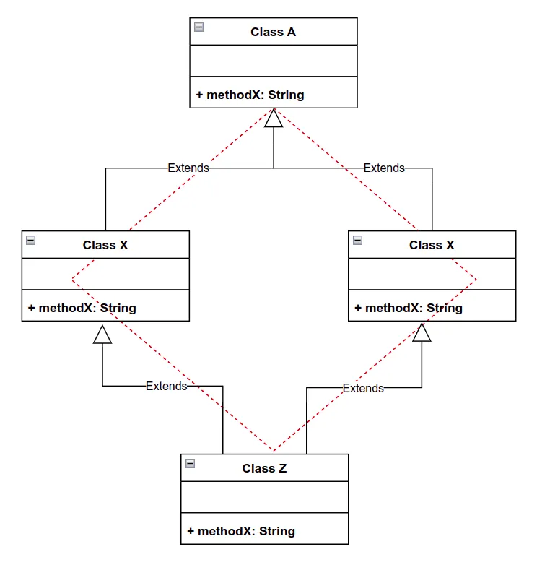

# OOP Concepts

## OOP Concepts

**Object-Oriented Programming (OOP)** is a programming paradigm based on the concept of "objects", which can contain data in the form of fields (attributes or properties) and code in the form of procedures (methods or functions). Java is an object-oriented programming language, and it embodies several key OOP concepts. Here are the fundamental OOP concepts in Java:

1. **Class**: A class is a blueprint or template for creating objects. It defines the properties (fields) and behaviors (methods) that objects of the class will have.

2. **Object**: An object is an instance of a class. It represents a specific entity with its own state (fields) and behavior (methods). Objects are created from classes using the new keyword.

3. **Encapsulation**: Encapsulation is the bundling of data (fields) and methods that operate on the data within a single unit (class). It restricts direct access to the data and requires access to the data through methods (getters and setters), which helps in data hiding and abstraction.
   Eg: POJO -private fields, public method,

4. **Inheritance**: Inheritance is a mechanism by which a new class (subclass or derived class) can inherit properties and behaviors from an existing class (superclass or base class). It promotes code reusability and allows for hierarchical classification of classes.
   Eg: extends, abstract class

5. **Polymorphism**: Polymorphism allows objects of different classes to be treated as objects of a common superclass. It enables methods to be invoked on objects without knowing their specific types, leading to flexibility and extensibility in code.
   Eg:
1. **Compile-time Polymorphism - Method Overloading**

   Method overloading allows a class to have multiple methods with the same name but different parameters or argument lists. The compiler determines which method to invoke based on the number, type, and order of arguments passed to it.

   Example:

   public class Calculator {

      public int add(int x, int y) {

        return x + y;

      }

       public double add(double x, double y) {

        return x + y;

      }

    }

   In this example, there are two add methods with different parameter types (int and double). The appropriate method is invoked based on the data types of the arguments passed during compilation.

2. **Runtime Polymorphism - Method Overriding**

   Method overriding occurs when a subclass provides a specific implementation of a method that is already defined in its superclass. This allows a subclass to provide its own implementation of a method that is already defined in its parent class.

   Example:

   class Animal {

      void makeSound() {

          System.out.println("Animal makes a sound");

      }

   }

   class Dog extends Animal {

      @Override

      void makeSound() {

          System.out.println("Dog barks");

      }

   }

   In this example, the Dog class overrides the makeSound method inherited from the Animal class to provide its own implementation. When the makeSound method is called on a Dog object, the overridden method in the Dog class is invoked

6. **Abstraction**: Abstraction is the process of hiding the implementation details of a class while exposing a simplified interface to the user. It focuses on what an object does rather than how it does it, promoting modularity and reducing complexity.
   Eg: implements, abstract class, interfaces

   abstract class Animal {
      abstract void makeSound();
       public void eat() {
        System.out.println("I can eat.");
      }
    }
     class Dog extends Animal {
       // provide implementation of abstract method
      public void makeSound() {
        System.out.println("Bark bark");
      }
    }

## Exploring Inheritance and Abstraction

[https://medium.com/nerd-for-tech/exploring-inheritance-and-abstraction-in-object-oriented-programming-1b23b68b1736](https://medium.com/nerd-for-tech/exploring-inheritance-and-abstraction-in-object-oriented-programming-1b23b68b1736)

In object-oriented programming (OOP), abstraction reduces complexity while inheritance reuses code.

| Abstraction  | Inheritance |
| :---- | :---- |
| Abstraction is the process of simplifying complex reality by modeling classes based on their essential characteristics and ignoring irrelevant details. In OOP, abstraction is achieved by defining abstract classes and interfaces. Abstract classes cannot be instantiated and are meant to be subclassed, while interfaces define a contract that classes must adhere to. | Inheritance is a fundamental concept in OOP that allows a new class to inherit attributes and behaviors from an existing class. The existing class is often referred to as the “base class” or “parent class,” while the new class is called the “derived class” or “child class.” Inheritance promotes code reusability, as it allows you to create a new class based on an existing class without having to rewrite its common features. |
| Hides unnecessary details from the user Simplifies complex systems Reduces the complexity of code by breaking it down into simpler parts A key element in developing good software design  | Allows programmers to create classes that are built upon existing classes Reduces code length by allowing programmers to reuse code Promotes code reuse Allows programmers to specify a new implementation while maintaining the same behaviors Allows programmers to independently extend original software |
| 1. **Hiding Complexity**: Abstraction allows developers to hide complex implementation details and expose only relevant functionalities to the outside world. This enhances security and ease of use. 2. **High-Level Design**: Abstract classes and interfaces provide a blueprint for designing classes, ensuring that all derived classes adhere to a common structure and set of methods. 3. **Flexibility**: Abstraction promotes loose coupling between classes. This means that changes made to an abstract class or interface won’t affect the implementation details of the derived classes, enhancing flexibility and reducing the impact of changes. | 1. **Code Reusability**:Inheritance enables developers to create a hierarchy of classes, where common attributes and methods are defined in the base class. This eliminates the need to duplicate code in multiple classes. 2. **Modularity**: Inheritance promotes the creation of modular code, as changes made to the base class automatically reflect in the derived classes. This simplifies maintenance and reduces the chances of errors. 3. **Polymorphism**: Inheritance is a key factor in achieving polymorphism, where objects of different derived classes can be treated as objects of the same base class. This allows for dynamic method invocation and improved flexibility in code design. |
|  | 1. **Single Inheritance**: A derived class inherits from only one base class. 2. **Multiple Inheritance**: A derived class inherits from multiple base classes. 3. **Multilevel Inheritance**: A chain of inheritance where a derived class becomes the base class for another class. 4. **Hierarchical Inheritance**: Multiple classes derive from a single base class. |

**How these concepts work together**

* Abstraction and inheritance are both important aspects of the Java language
* Inheritance and polymorphism are both concepts in OOP that help achieve code reusability
* Polymorphism adds flexibility to method behavior
* Encapsulation ensures data security

Inheritance and abstraction are often used together to create well-organized and manageable codebases. Abstract classes serve as a foundation for derived classes, while inheritance allows the derived classes to acquire the properties and behaviors of the abstract class. This combination fosters a hierarchical structure that promotes code reusability, modularity, and efficient design.

Inheritance and abstraction are two pivotal concepts in Object-Oriented Programming that empower developers to build scalable and maintainable software systems. Inheritance facilitates code reusability and promotes a hierarchical structure, while abstraction simplifies complex systems and enforces a high-level design. Mastering these concepts is essential for any developer striving to create efficient and flexible code that can stand the test of time. By leveraging the power of inheritance and abstraction, software engineers can craft elegant solutions to even the most complex programming challenges.

## Class Relationships

[https://www.geeksforgeeks.org/aggregation-in-ooad/?ref=lbp](https://www.geeksforgeeks.org/aggregation-in-ooad/?ref=lbp)
[https://medium.com/@humzakhalid94/understanding-object-oriented-relationships-inheritance-association-composition-and-aggregation-4d298494ac1c](https://medium.com/@humzakhalid94/understanding-object-oriented-relationships-inheritance-association-composition-and-aggregation-4d298494ac1c)
[https://medium.com/@bindubc/association-aggregation-and-composition-in-oops-8d260854a446](https://medium.com/@bindubc/association-aggregation-and-composition-in-oops-8d260854a446)

In Object-Oriented Analysis and Design (OOAD), the relationship among objects is fundamental to modeling the behavior and structure of a system, and Object diagrams are used to depict instances of classes and their relationships at a specific point in time. There are several types of relationships among objects:

**1. Association**
The association represents a relationship between two or more objects where they are connected through a link. It can be a one-to-one, one-to-many, or many-to-many relationship. For example, a "Student" object may be associated with a "Course" object through an enrollment relationship.
class Student(val name: String)

class Course(val title: String)

val student1 = Student("Alice")
val course1 = Course("Mathematics")
student1.courses = listOf(course1)

**2. Aggregation**
Aggregation is a special form of association where a part-whole relationship exists between objects, and the part (child) can exist independently of the whole (parent). For example, a "Car" object can have an "Engine" object as a part, but the engine can exist outside the car.
class Department(val name: String) {
   val employees = mutableListOf<Employee>()
}

class Employee(val name: String)

val hrDepartment = Department("HR")
val employee1 = Employee("Alice")
hrDepartment.employees.add(employee1)

**3. Composition**
Composition is a stronger form of aggregation where the part (child) cannot exist without the whole (parent). For example, a "House" object may be composed of "Room" objects, and if the house is destroyed, the rooms are also destroyed.
class Engine {
   fun start() {
       println("Engine started.")
   }
}

class Car {
   private val engine = Engine()

   fun drive() {
       engine.start()
       println("Car is moving.")
   }
}

**4. Inheritance**
Inheritance is a mechanism where one class (subclass or child class) inherits properties and behaviors from another class (superclass or parent class). It allows for code reuse and supports the "is-a" relationship. For example, a "Dog" class can inherit from an "Animal" class.
open class Animal(val name: String) {
   fun speak() {
       println("$name makes a sound.")
   }
}

class Dog(name: String, val breed: String) : Animal(name) {
   fun bark() {
       println("$name, the $breed, barks loudly.")
   }
}

**5. Dependency**
Dependency represents a relationship where one class (client) depends on another class (supplier) for its functionality. If the supplier class changes, the client class may need to be modified. For example, a "Person" class may depend on a "Car" class to drive, but the person can exist without the car.

### Aggregation vs. Composition

| Characteristic | Aggregation | Composition |
| :---- | :---- | :---- |
| **Relationship** | Represents a "has-a" relationship. | Represents a "part-of" relationship. |
| **Ownership** | No ownership implied. | Implies ownership. |
| **Coupling** | Relatively loose coupling. | Strong coupling. |
| **Multiplicity** | Varies (0 to many). | Typically fixed (one or more). |
| **Dependency** | Less dependency between the whole and its parts. | Strong dependency between the whole and its parts. |

## Diamond Problem

Talking about Multiple inheritance is when a child class inherits the properties from more than one parent and the methods for the parents are the same (Method name and parameters are exactly the same) then the child gets confused about which method will be called. This problem in Java is called the Diamond problem.

**Solution**
Java avoids direct support for multiple inheritance to mitigate the Diamond Problem.
We can implement a class with any number of interfaces

**But what happens if two interfaces are also having the same identical method?**

interface X {
   default void methodX() {
      System.out.println("X:::methodX");
   }
}
interface Y {
   default void methodX() {
      System.out.println("Y:::methodX");
   }
}
public class Z implements X, Y {
   public void methodX() {
       // what to do here???
   }
   public static void main(String args[]) {
      Z z = new Z();
      z.methodX();
   }
}

1. **Override the class method with own logic**
   public class Z implements X, Y {
      public void methodX() {
          System.out.println("ZClass:::methodX");
      }
      public static void main(String args[]) {
         Z obj = new Z();
         obj.methodX();
      }
   }
2. **Override the class method with one of the inherited interface implementation**
   public class Z implements X, Y {
      public void methodX() {
          X.super.methodX();
          // OR
          Y.super.methodX();
      }
      public static void main(String args[]) {
         Z obj = new Z();
         obj.methodX();
      }
   }
